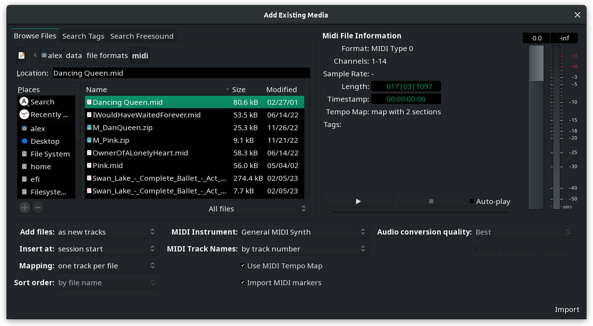
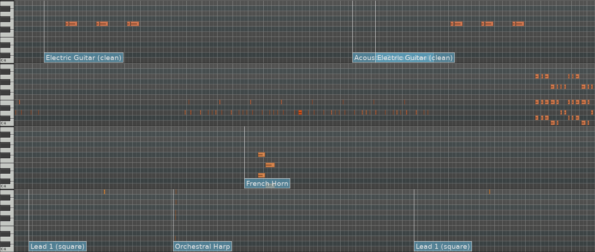
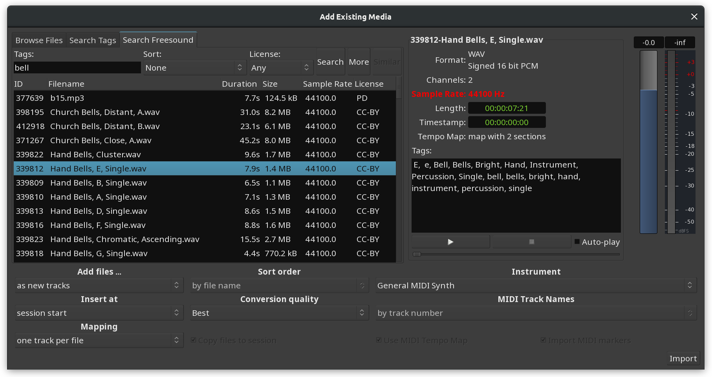
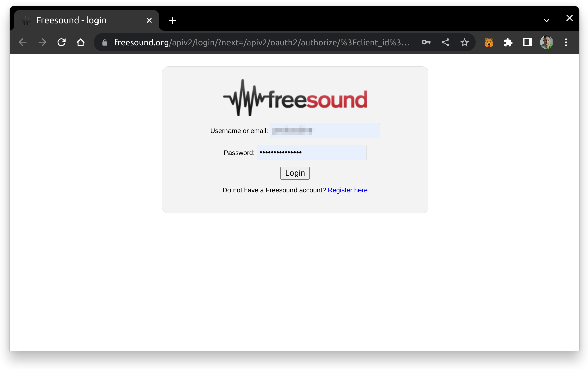
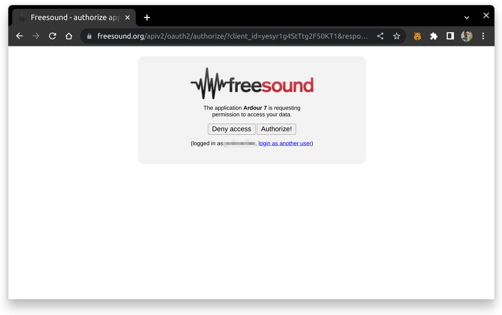
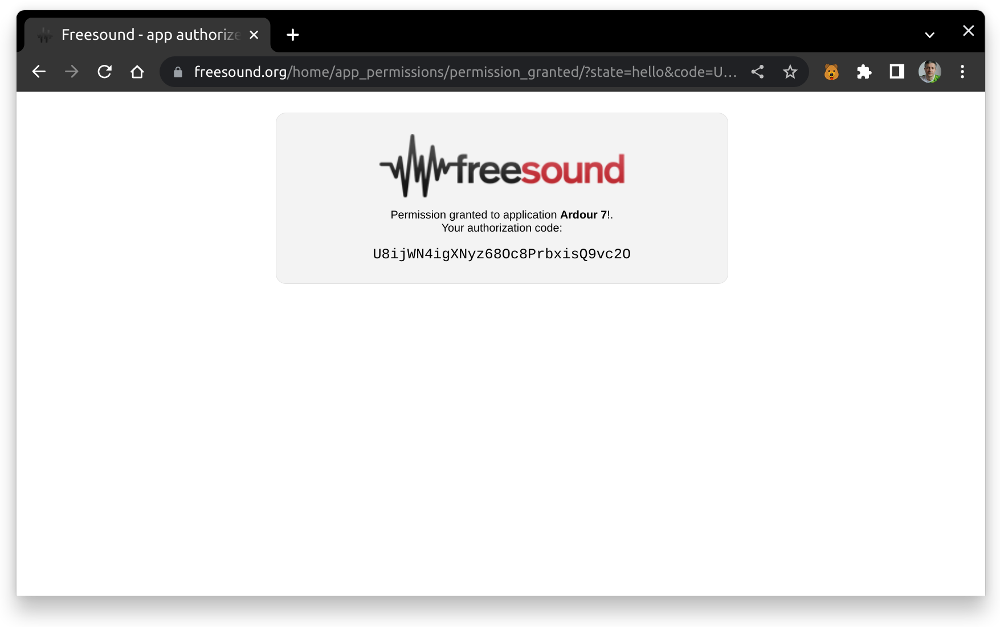
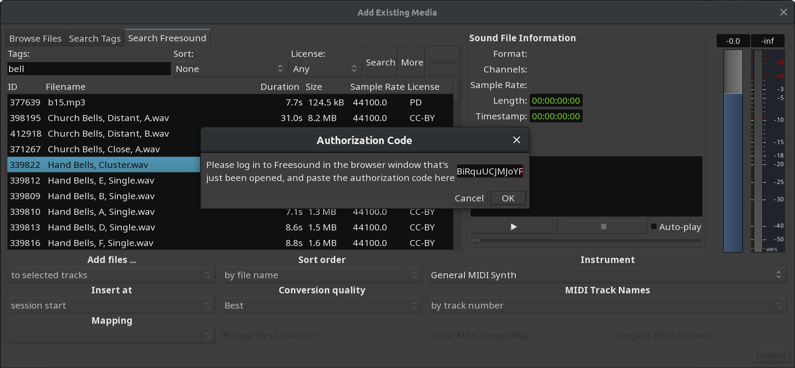

.. _add_existing_media:

Add Existing Media dialog
=========================

Many sessions will require the use of existing material, whether it consists of audio and/or MIDI data. Using existing samples, loops and riffs from files stored on the system can be the basis for a new session, or a way to deepen and improve one that is already underway.

Importing audio and MIDI data into the session is done with the **Add Existing Media** dialog, accessed either by the **Session > Import** menu or, if any tracks have already been added, by right-clicking on the canvas of the Editor window and choosing Insert Existing Media.

   The Add Existing Media window.

The Soundfile Information box
-----------------------------

This box will display information about the currently selected file:

-  number of channels,
-  sample rate,
-  file format,
-  length,
-  embedded timestamp (applies to some professional formats such as
   Broadcast WAVE), and
-  :ref:`tags <searching_for_files_using_tags>` (attached metadata to help categorize files in a library).

If the sample rate differs from the current session rate, it is displayed in red, which indicates that the file must be resampled before importing.

Resampling is controlled by the **Conversion quality** option described below.

Auditioner
----------

Files can be auditioned before importing. The slider under the play and stop buttons allows to scrub around, a fader on the right side allows to control the playback volume.

Auditioning MIDI files requires a MIDI instrument to be chosen in the Instrument dropdown list.

Importing options
-----------------

Through the **Add files…** option, imported files can be inserted in the
session:

as new tracks
   Automatically creates new tracks and import the files in it

to region list
   Adds the files to the :ref:`region list <the_region_list>`, from where then can be manually dragged into a track

as new tape tracks
   Adds the files as :ref:`Tape tracks. <track_types>`

The **Insert at** option chooses where in time the file will be imported, amongst:

-  the file timestamp (if available, zero by default)
-  at the :ref:`edit point <edit_point_control>`
-  at the playhead
-  at the session start.

The **Channel Mapping** option is only available for multi-channel files
(i.e. all but mono ones). The choices are:

one track/region per file
   Creates a multi channel track for each imported file

one track/region per channel
   Creates only mono channels, as many as there are channels in the imported files

sequence files
   If multiple files are imported, they can be sequenced into a single track in the order of selection

The **Conversion quality** drop-down controls the quality of the resampling process, if the sampling rate of the source file differs from the session rate.

There are three MIDI-specific options as well. First off, you can set a
track naming scheme:

by track number
   Will automatically assign every track a name that consists of the imported file name and a

by track name
   Will automatically assign every track a name that consists of the imported track's name and number

by instrument name
   Will automatically assign every track a name that consists of the imported instrument's name and a track number

You can also optionally import a tempo map from a MIDI file. The Use MIDI Tempo Map option appears when a MIDI file is selected in the file selection dialog.

The last MIDI-specific option is **Import MIDI Markers**. If those are present in a MIDI file, they will be rendered right above MIDI clips on the canvas. Editing the MIDI markers is currently unavailable. If MIDI lyrics is available in the file, it was also be imported as region markers (that can be later promoted to location markers).

   MIDI markers imported from a .mid file

Finally, and most importantly, the files can be linked or copied to the session with the Copy files to session checkbox. Please read :ref:`Copying versus Linking <copying_versus_linking>` for details.

Importing from FreeSound.org
----------------------------

Ardour can import sounds from the public library at FreeSound.org. This feature requires an account with the online service.

Sound clips on FreeSound.org typically have metadata in form of tags that give a general idea what sound is recorded in a clip. Ardour will use that metadata to find sound clips that match your request.

   List of sound clips found on FreeSound.org

There are two more options for the search:

#. **Sort**: allows sorting all sound clips that match your request in a particular order. Changing the type of sorting requires running the search again.
#. **License**: allows limiting your search by choosing a particular license depending on how you license your own work.

Ardour will list all sounds clips that match your request right in the window. If there are a lot of option, click the More button to load the next page with results.

When you click on any sound clip in the list for the first time, a FreeSound.org login page will open in your preferred web browser.

   Log into FreeSound.org

You will then be asked to grant access to Ardour.

   Grant access to Ardour

Once you do that, FreeSound.org will generate authorization code that you need to select and copy to the clipboard.

   Authorization code

Finally, insert the code into the entry box here and click **OK**.

   Insert authorization code

After that, Ardour will be able to download clips for preview in a folder for temporary files that you can select in the **Preferences** dialog on the **General** page.

You can preview and insert clips from FreeSound.org like any other sound files.

Please note that authorization code only works as long as Ardour is running. The next time you start Ardour, you will need to authorize it again. This is implementation specifics of FreeSound.org.
