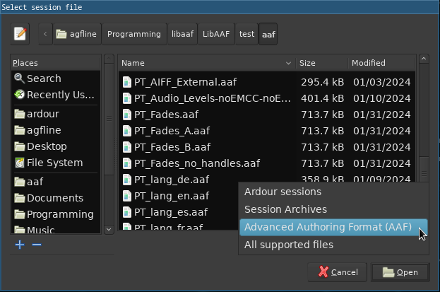

.. _interchange_with_other_daws:

Interchange with other DAWs
===========================

It has never been particularly easy to move sessions or projects from one DAW to another. There are two interchange standards that have reasonably widespread support:

-  OMF (Open Media Framework), also known as OMFI. Developed and controlled by Avid, never standardized
-  AAF (Advanced Authoring Format). Developed by a consortium of media-related corporations.

In practice both of these standards have such complex and/or incomplete specifications that different DAWs support them only partially, differently, or not at all.

Transferring an Ardour session from / to another DAW
----------------------------------------------------

To move a session from another DAW to Ardour, or from Ardour to another DAW, there are two basic choices:

-  :ref:`Stem exports <stem_exports>`
-  `Using AATranslator <#using_aatranslator>`__

Importing AAF files
-------------------

Ardour supports importing AAF session files, including fades, volume automation, pan and multichannel tracks/regions.

To import an AAF file, you have to open the session file selection dialog :

-  By clicking the Other Sessions button on the :ref:`Session Setup Dialog <new_open_session_dialog>`,
-  Or by going to **Session > Open…** menu.

   Select Session File Dialog

Select **Advanced Authoring Format (AAF)** in the file type filter, then select an AAF file and click **Open**.

Importing ProTools® files
-------------------------

Ardour provides a basic import tool for ProTools® sessions, in the **Session > Import PT Session** menu.

Though incomplete, this import is intended for ptf and ptx files. Protools® 5, 8, 9, 10, 11 have been tested with varying degrees of success. (versions 6 and 7 are not supported).

The elements of the files that are imported are:

-  Audio regions data & position
-  MIDI notes (fused to a unique region).

.. _using_aatranslator:

Using AATranslator
------------------

AATranslator is a Windows application that can convert sessions/projects from many different DAWs into other formats. At the present time (December 2016), it can read and write Ardour 2.X sessions, and can read Ardour 3 sessions.

The program runs very well on Linux using `Wine <http://www.winehq.org/>`__ (a Windows environment for Linux). There are equivalent solutions for running Windows applications on OS X, but we have no experience with them at this time. Ardour users have reported great results using AATranslator on Ardour 2.X sessions.

The `AATranslator website <http://www.aatranslator.com.au/>`__ has full details on supported formats and DAWs. The list includes ProTools, Live, Reaper, OMF, AAF and many more.

AATranslator is closed-source, non-free software (as of this writing, June 2017, the cost is 59 USD for the "Standard" version, and 199 USD for the "Enhanced" version).
