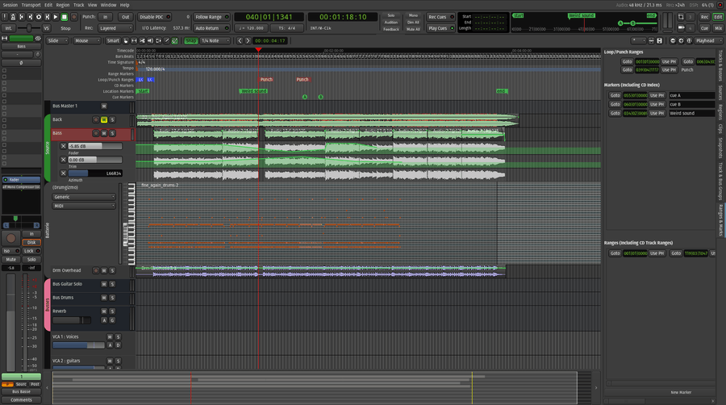
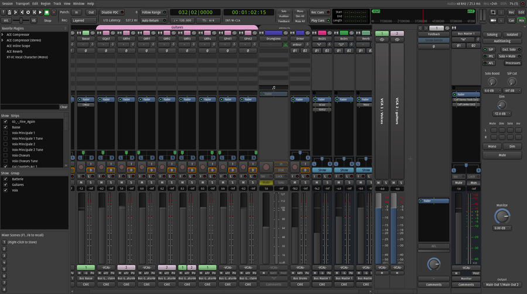
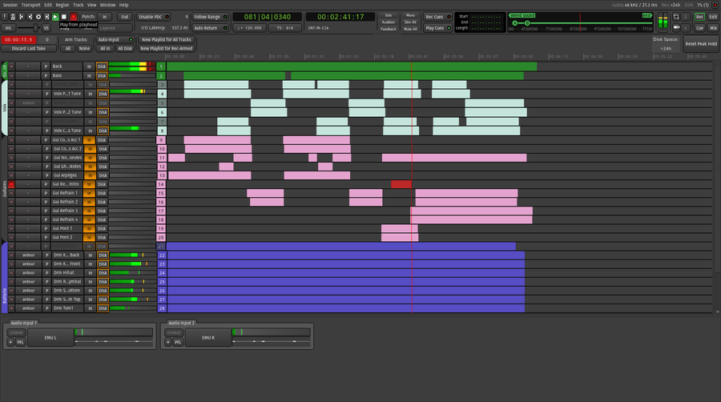
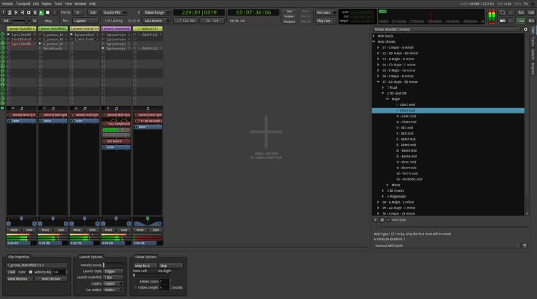

Ardour's interface overview
###########################

In Ardour, work is done in one of four windows: the :guilabel:`Editor`, the :guilabel:`Mixer`, the :guilabel:`Recorder`, or the :guilabel:`Cue`.

.. raw:: html
   <figure class="imagemap" style="width:100%;">
   
   <!-- common -->
   
   
   
   
   
   
   
   
   
   
   
   
   
   <!-- editor -->
   
   
   
   
   
   
   
   
   
   
   
   
   
   
   
   
   
   <figcaption>
      The Editor window. Clicking on a section accesses its description.
   </figcaption>
   </figure>

   description.
   :width: 900px
   :height: 502px

   The Editor window. Clicking on a section accesses its description.

   description.
   :width: 900px
   :height: 502px

   The Mixer window. Clicking on a section accesses its description.

   description.
   :width: 900px
   :height: 502px

   The Recorder window. Clicking on a section accesses its description.

   description.
   :width: 900px
   :height: 502px

   The Cue Grid window. Clicking on a section accesses its description.

The Editor, Mixer, Recorder and Clip Launcher share the same toolbar (the top of the window). The sections displayed in this toolbar can be customized to the user's workflow, by checking options in :menuselection:`Preferences > Appearance > Toolbar`.

Switching between these 4 different modes is done:

-  with the `Mode Selector buttons <@@other-toolbar-items#mode_selector>`__ in the upper right
-  with the menu :menuselection:`Window > Editor` (or :menuselection:`Mixer / Recorder / Cue Grid > Show`.

Additionally, the M shortcut allows switching between the Editor and Mixer.

Multiple windows can be visible at the same time (e.g. for a multi-monitor setup) using :menuselection:`Window > Editor` (or :menuselection:`Mixer / Recorder / Cue Grid > Detach` option in the same submenu.

The Editor
**********

The Editor window includes the editor track canvas where audio and MIDI data can be arranged along a timeline. This is the window where editing and arranging a project is done. The window has a general "horizontal" sense to it: the timeline flows from left to right, the playhead showing the current position in the session moves from left to right—the window really represents time in a fairly literal way.

It is possible to show a single channel strip in the editor window, and some people find this enough to work on mixing without actually opening the mixer window. Most of the time though, both of these windows will be needed at various stages of a session's lifetime.

The Mixer
*********

The Mixer window represents signal flow and is the window that will probably be used most when mixing a session. It includes channel strips for each track and bus in the session. It has a general "vertical" sense to it: signals flow from the top of each channel strip through the processing elements in the strip to reach the output listed at the bottom.

To learn more about the process of mixing, see
`Mixing <@@basic-mixing>`__.

The Recorder
************

The Recorder window is a very specialized view that provides a compact view of all track's record and monitor status, and a simplified timeline that keeps everything in view at once. Most of the information that is shown in this mode is already available in Mixer or Editor mode, but the Recorder aims at having everything in sight and under control while tracking a performance.

The Recorder is covered in great detail in `its own page <@@recorder>`__.

The Cue Grid
************

The Cue Grid window, unlike the rest of Ardour, allows for a non-linear workflow. It is a clip launcher, that allows to chain and combine various loops and samples, and program events.

Instead of anchoring these samples or loops on a timeline, the Cue Grid gives them instruction on when they are triggered, how they are played, what happens at the end of the clip, etc…

The `Cue <@@cue>`__ section of this manual describes this worfkow.
