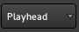

.. _edit_point_control:

Edit point control
==================

   Editor toolbar's edit point

Editing operations in a Digital Audio Workstation like Ardour can be broken down according to how many points on the timeline are required to carry the operation out. Splitting a region for example, requires just one position on the timeline—the one where the split will happen. Cutting out a time range requires two positions, one for the start of the cut and one for the end.

In Ardour the **edit point** is the location where most single-point editing operations take place. It can be set to any of the following:

-  the **Playhead** position
-  the selected (or "active") **Marker**
-  the position of the **Mouse** (or touch) pointer

The default edit point is the location of the mouse pointer.

There are two keybindings available to cycle through the edit point options. The most common workflow tends to involve switching back and forth between the playhead and mouse as the edit point. Pressing the grave accent key :kbd:`\`` switches between these two. Using :kbd:`\`` cycles through all three choices (including the selected marker). The edit point can also be switched using the combo-selector just right of the snap/grid unit selector.
