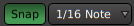

.. _grid_controls:

Grid controls
=============

   Snap & Grid

.. _grid_controls_snap:

Snap
----

**Snap** will cause region drags and other mouse-driven operations to jump to positions determined by the nearest snap setting when the mouse is close enough to this snap point. Snapping is sometimes (improperly) referred to as magnetism.

The snapping options are set in the :ref:`Preferences <preferences_editor_snap>`. Those include the snap threshold which determines how close the mouse has to be to a snap anchor to induce a snap, and the snap anchors themselves, among:

-  Markers
-  Region Sync points
-  Region Starts
-  Region Ends
-  Grid.

.. _grid_controls_grid:

Grid
----

The **Grid** helps visually placing items in time. It will draw lines at selected intervals as chosen in the drop-down selector. Musical grid settings (**Bar** to **Sextuplets**) obviously depend on the :ref:`tempo_and_meter>`, so changing the tempo or time signature will rescale the grid, while absolute grid settings (**Timecode**, etc…) won't be affected.

A word about time signature in this context: a time signature consists of 2 numbers. The upper one determines how many beats are in a bar, the lower one, what division of a note a beat represents (e.g. : *4* stands for a quarter note). At e.g. 80 bpm, one beat lasts 1/80th min, so 0.75 sec. If the time signature is 3/4, there are 3 beats in a bar so a bar lasts for 3 × 0.75 = 2.25 sec. Choosing **1/8 Note** as the grid setting will draw grid lines every 0.75 ÷ 1/4 × 1/8 = 0.375 sec.

The grid density can be either based on musical time:

-  **No Grid**: hides the Grid
-  **Bar**: shows one grid line per bar (e.g, in 4/4 at 120bpm, one line every 2 seconds)
-  **1/4**: shows one grid line per quarter bar, or 4 grid lines per bar (e.g, in 4/4 at 120bpm, one line every .5 seconds)
-  *...*
-  **1/128**: shows one grid line per 128\ :sup:`th` bar, or 128 grid lines per bar
-  **Triplets**: groups the ternary divisions of time:

   -  *1/3 (8th triplet)*: shows one grid line per third bar
   -  *...*
   -  *1/24 (64th triplet)*: shows one grid line per 24\ :sup:`th` bar

-  **Quintuplets**: groups the 1/5\ :sup:`th` divisions of time:

   -  *1/5 (8th quintuplet)*: shows one grid line per fifth bar
   -  *...*
   -  *1/20 (32th quintuplet)*: shows one grid line per 20\ :sup:`th` bar

-  **Septuplets**: groups the 1/7\ :sup:`th` divisions of time:

   -  *1/7 (8th septuplet)*: shows one grid line per seventh bar
   -  *...*
   -  *1/28 (32th septuplet)*: shows one grid line per 28\ :sup:`th` bar

Or absolute time:

-  **Timecode**: shows one grid every :ref:`frame <on_clock_and_time>`
-  **MinSec**: shows one grid line every thousandth of a second
-  **CD Frames**: shows one grid line per CD Frame (1/75\ :sup:`th` second)

Alternatively, Ardour can disable the usual musical/non-musical time grid and make the current playhead position the only snappable target. To do that, select the "Playhead" item in the drop-down list.

.. important::
   The grid consist of lines running vertically in the edit canvas. When zooming too far out, the grid can become too coarse. Ardour tries not to show “too many” or “too few” grid lines depending on the zoom level, based on the *Approximate Grid/Ruler granularity (pixels)* :ref:`preferences_editor_snap` parameter. As a consequence, when the Grid is in the Snap anchors, it is possible that items snap in-between the grid lines sometimes. That’s expected behavior.

Syncing Regions to the Grid
~~~~~~~~~~~~~~~~~~~~~~~~~~~

By default, a region's beginning will be used as the reference for both types of snapping, this behaviour can be changed by setting a **sync point** in the region, by selecting the region(s) and pressing :kbd:`V`. This will set the sync point to the current :ref:`edit point <edit_point_control>`.

Keyboard modifiers
~~~~~~~~~~~~~~~~~~

Snapping can be temporarily disabled by using a keyboard modifier while editing, :kbd:`Alt` by default.

Snapping can also be temporarily set to relative, i.e. snapping will occur relative to the current position of the dragged item. E.g. if the Grid is in the Snap options, and the grid is set to **Bars**, using this keyboard modifier while dragging will snap at every bar relative to the region's beginning (or sync point) instead of the absolute musical bars.

The keyboard modifiers are defined in the :ref:`preferences`.
