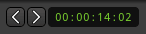

.. _nudge_controls:

Nudge controls
==============

   Editor toolbar's Nudge

The nudge controls will move the selected region(s) or notes in MIDI regions by a fixed amount of time. The left and right buttons move either backward or forward in time, and the small clock to the right of these buttons sets the amount of time to nudge by.

The clock, as with all other clocks, can be right-clicked on to choose the desired :ref:`time representation <editing_clocks>`. The menu also allows:

-  :guilabel:`Set from Playhead`: the clock is the current position of the playhead
-  :guilabel:`Locate to this time`: moves the playhead to the the clock time
-  :guilabel:`Copy to clipboard`: copies the clock (with formatting) to the
   clipboard.

Combining these three options allow to e.g. memorize the current playhead position (*Set from playhead*) and reposition the playhead (*Locate to this time*) at that position after another edit.

If there are no selected objects, the nudge controls can be used to move the playhead backward or forward by the amount shown on the clock.
