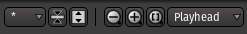

Zoom controls
=============

   Editor toolbar's zoom

The zoom controls allow to navigate the session along both the time and
track axes. The controls are described from right to left:

.. _zoom-along-time-axis:

Along the time axis
-------------------

The Zoom Focus drop-down menu (defaults to :guilabel:`Playhead`) allows to select a focus point for the zoom, i.e. the center of the zoom, to choose amongst:

-  Left of the screen
-  Right of the screen
-  Center of the screen
-  Playhead
-  Mouse
-  Edit Point as set in the `Edit point <@@edit-point-control>`__ control.

The two zoom buttons (:kbd:`−` and :kbd:`+`) use this zoom focus to zoom out and in respectively.

The :guilabel:`Zoom to Session` button (:kbd:`[ ]`) is a handy shortcut to zoom out or in until all the session (as defined by its `start/end markers <@@working-with-markers>`__) fits horizontally.

.. _zoom-along-track-axis:

Along the tracks axis
---------------------

Two buttons, :guilabel:`Shrink tracks` and :guilabel:`Expand tracks`, reduce or expand the vertical size of the selected tracks. If no track is selected, all the tracks will be shrunk or expanded each time the button is pushed.

Last, the dropdown menu (:kbd:`*` by default) allows changing the number of visible tracks to fit vertically on screen.

.. note::
   There *is* a minimal track height to keep it visible, so according to the vertical screen size, some high number can have no effect.

Besides numbers that correspond to the number of tracks to show, there are two special choices:

-  Selection that focus on the selected tracks. If the selected tracks are not contiguous, the unselected tracks inbetween will be hidden, see the `Track and Bus list <@@the-tracks-and-busses-list>`__.
-  All that fits all the tracks of the sessions vertically (provided there's enough screen estate).
