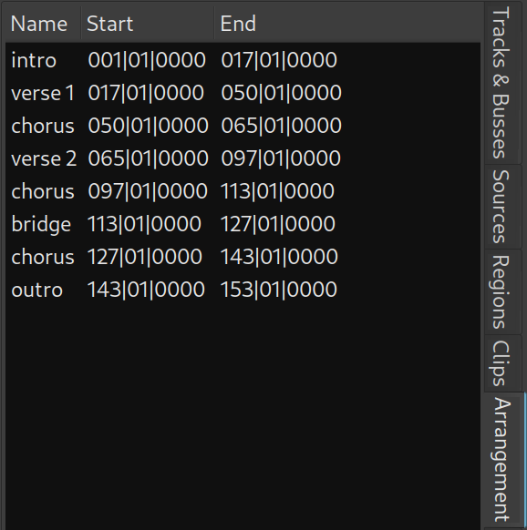
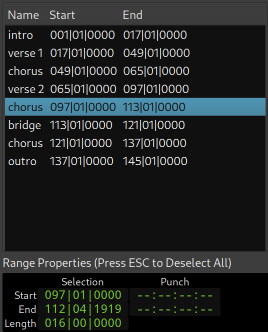

.. _arrangement_list:

Arrangement
===========

The Arrangement list shows all range sections in the session, with start and end time for each of them in the time domain of the first clock.

   Arrangement list

Selecting a range section in the list opens a small window below that display range section timing: end, start, and duration. Its time domain can be selected in the right-click menu.

   Selected range section in the Arrangement list

Copying and pasting range sections
----------------------------------

An existing range section can be easily copied and pasted using this list editor. Simply pick a range section and drag it up or down to insert between two other existing sections, before the first section, or after the last section.

Renaming range sections
-----------------------

To rename an existing range section, either double-click its name or right-click it and select the **Rename the selected Section** menu item, then input the new caption of the range section, and press :kbd:`Enter` to confirm.

To cancel the renaming before the confirmation, press the :kbd:`Esc` key.

Removing range sections
-----------------------

To remove an existing range section, either press the :kbd:`Del` key or select the **Remove the selected Section** menu item.
