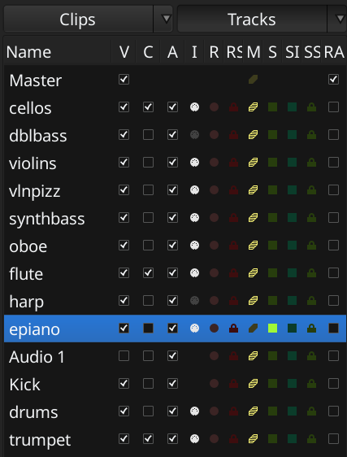

.. _editor_and_cue_lists:

Editor and cue lists
====================

The **Editor** and the **Cue** windows have an optional area called **Editor List**. It contains multiple lists: tracks and busses, sources, regions, reusable clips, various markers etc.

   Editor list

The Editor list is not shown by default when you run Ardour for the first time. It can be hidden or shown using **View > Show Editor List** menu command.

This area appears on the right side of the window. The left-hand border of the list can be dragged to show more columns where appropriate (alternatively, you can scroll the bottom scrollbar to see more).

The Cue window displays only a part of all possible lists — ones that make sense for this non-linear sequencer: **Clips**, **Tracks**, **Sources**, and **Regions**.

It's possible to quickly switch between two diferent lists. To select a list and switch to it, click on the part of the button that contains a triangle icon pointing downwards. To switch to an already selected list, click the main part of the button.

.. toctree::
   :maxdepth: 1
   :caption: Contents

   tracks-and-busses-list.rst
   sources-list.rst
   regions-list.rst
   arrangement-list.rst
   clips-list.rst
   snapshots-list.rst
   track-and-bus-groups-list.rst
   ranges-and-marks-lists.rst