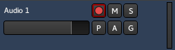

.. _audio_track_controls:

Audio track controls
====================

Each track shows a header section, for settings relevant to this track
only.

Changing the height of the track can be done either:

-  By using the **Track > Height** menu. The **Fit selection (Vertical)** (default: :kbd:`F`) is particularly useful.
-  By double-clicking an empty space in the track header, to toggle the track's height between the **Normal** and **Largest** track heights from this menu.
-  Or by grabbing the bottom of the track header with a left click and drag.

At the top-left of the controls is the name of the track, which can be edited by double-clicking on it. The new name must be unique within the session.

Underneath the name is the track's main level fader. Changing it will affect the whole track:

-  Dragging will change the fader's value as per the mouse's position
-  Ctrl-clicking will set the fader to −∞
-  Shift-clicking will reset the fader to its original 0dB position.

On the right-hand side of the headers are level meters for the outputs
of the track (1 level per output).

The control buttons are:

:kbd:`●` (Record)
   The button with the pink circle arms the track for recording. When armed, the entire button will turn pink, and change to bright red as soon as the transport is rolling and the track is recording. Right-clicking will allow to en/disable Rec-safe, protecting the track against accidental recording.

:kbd:`M` (Mute)
   Mutes the track. Right-clicking displays a menu which dictates what particular parts of the track should be muted.

:kbd:`S` (Solo)
   Soloes the track. The behaviour of the solo system is described in detail in the section :ref:`Muting and Soloing <muting_and_soloing>`. Right-clicking will allow to en/disable Solo isolate and Solo safe.

:kbd:`P` (Playlist)
   Opens a playlist menu when clicked. The menu offers various operations related to the track's :ref:`playlist <playlists>`.

:kbd:`A` (Automation)
   Opens the automation menu for the track. For details see :ref:`Automation <automation>`.

:kbd:`G` (Group)
   Allows to assign the track to an existing or a new group. For details see :ref:`Track and bus groups <track_and_bus_groups>`.
