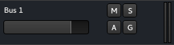

.. _bus_controls:

Bus controls
============

The bus' header is very similar to the :ref:`audio track header <audio_track_controls>`, minus :
-  The playlist button, as a bus doesn't have any playlists or regions by itself, it is only a pipe to route audio or midi through
-  The record button, for the same reason.

For more information about the bus concept, see :ref:`Understanding basic concepts <understanding_basic_concepts_and_terminology_busses>`.
