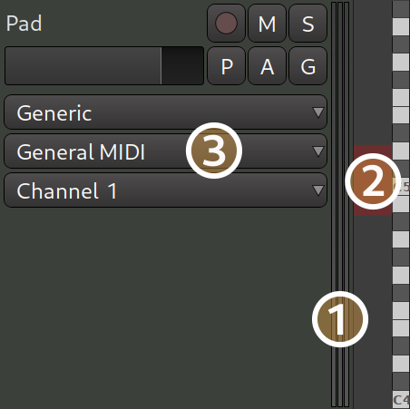
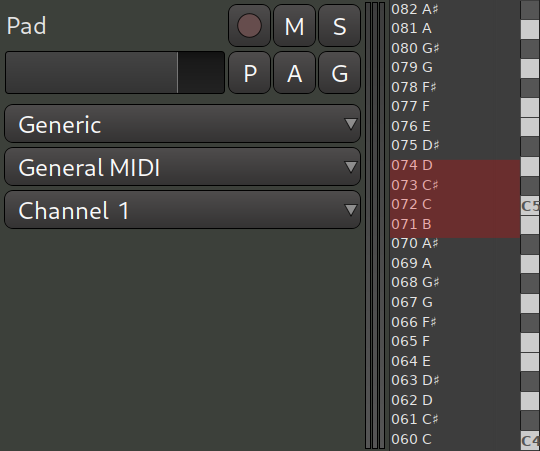
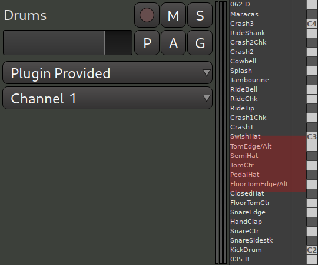
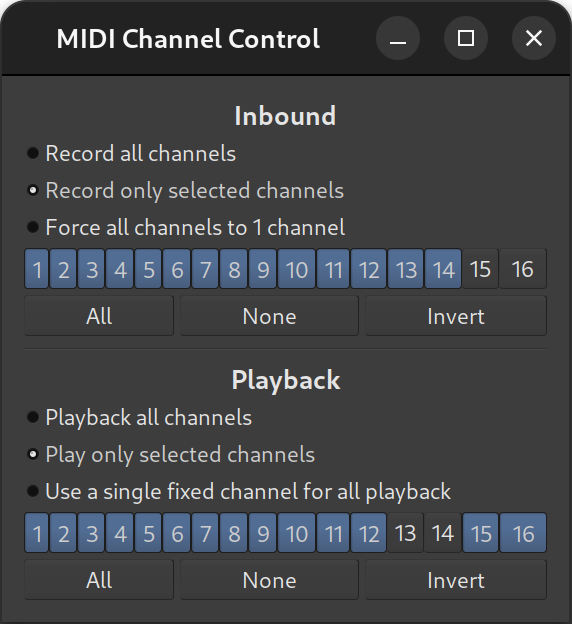
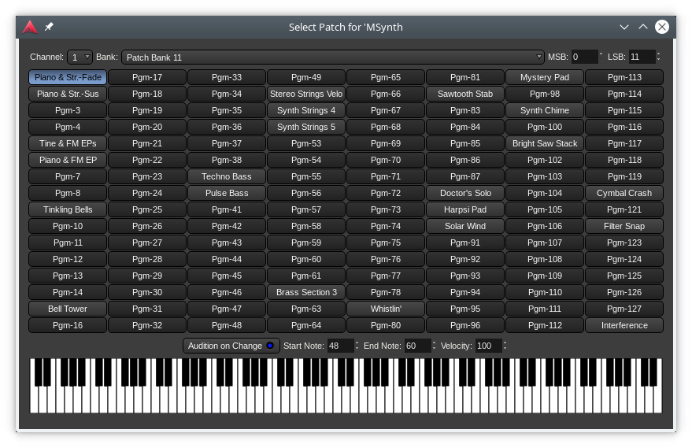

.. _midi_track_controls:

MIDI track controls
===================

A MIDI track has the same basic controls as an :ref:`audio track <audio_track_controls>`, with a number of differences.

#. The **level meters** for the track's outputs show MIDI output in red, on the left; Audio output in green, on the right
#. The **scroomer**, a combined scroll and zoom widget for controlling MIDI notes display range, is unique to MIDI tracks
#. An **External MIDI Device** combobox can appear, for selecting :ref:`MIDNAMs <patch-change#midnam>`
#. An **External Device Mode** combobox can appear, for selecting an external device's mode, in case no relevant External MIDI Device has been selected

.. note::
   To show the full set of MIDI track controls, the :ref:`track height <track-height>` must be increased beyond the default height. MIDI tracks will show only a few of the control elements when there is insufficient vertical space. As for :ref:`Audio tracks <audio-track-controls>`, this can be done by either toggling the track's full screen mode (**Track > Height > Fit selection (Vertical)**, default: :kbd:`F`, or by simply double-clicking an empty space in the track header, to increase the track's height.

   Further, the External MIDI Device and External Device Mode comboboxes will **not** appear if there is a synth plugin on the track that comes with an associated :ref:`MIDNAM <patch_change_midnam>`.

The Scroomer
------------

The Scroomer performs the following functions:

-  The scrollbar controls the range of pitches that are visible on the
   track, as visualized by the piano keyboard. Dragging the body of the
   scrollbar up and down displays higher or lower pitches.
-  Dragging the scrollbar handles zooms in and out and increases or
   decreases the range of visible pitches.
-  Double clicking the scrollbar auto-adjusts the zooms to make the
   range of visible pitches fit the actual content of the track.
-  Clicking on the piano plays the corresponding MIDI note for
   reference.
-  :kbd:`Shift`-left-clicking on a note adds the note to the selection (for all
   regions on the track). See :ref:`Note Selection <note_selection>`.
-  Middle-clicking a note clears the selection, selects only the note.

Scroomer's user interface looks lightly differently depending on the currently selected tool. For most tools, the UI is the same as on the screenshot above. However, when either the **Draw** or the **Edit** tool is selected, the scroomer will additionally display notes (e.g. ``048 C``, ``049 C#``):

   Notes in the scroomer

If a virtual instrument loaded into the MIDI track provides MIDNAM data, Ardour will read and display note names rather than notes:

   Note names in the scroomer

You can configure Ardour to always show note names when they are available or never show them. The setting is on the **Appearance > Editor** page of the **Preferences** dialog.

The extent to which scroomer can zoom into the pianoroll depends on the maximum size of a note cell. This setting is available on the **MIDI** page of the **Preferences** dialog.

Channel and patch selection
---------------------------

The Channel Selector
~~~~~~~~~~~~~~~~~~~~

A MIDI track's data may utilize any number of the 16 available MIDI channels, and it is useful to be able to filter out a subset of those or force the input or output to utilize only certain channels. The **Channel Selector** dialog allows for filtering or modification of both the input and output of any given MIDI track.

The **Channel Selector** dialog is activated by right-clicking on a MIDI track's header and selecting **Channel Selector…** from the menu that appears. Filtering or modification of inbound MIDI events for the given MIDI track is done by selecting among:

-  Record only selected channels
-  Force all channels to 1 channel

Selecting **Record all channels** does no filtering of inbound MIDI events.

If simple filtering of incoming MIDI events is desired, **Record only selected channels** should be selected. A 1-by-16 grid of squares with numbers in them will become sensitive to mouse clicks, and the desired channels to be allowed through the filter can then be selected by clicking on them. Channels that are allowed to pass through will be highlighted in green.

Force all channels to 1 channel will rewrite the channel number of all incoming events of the selected MIDI track to whichever channel is highlighted in the 1-by-16 grid of squares. When this option is chosen, one and only one channel can be selected.

Filtering or modification of outbound MIDI events is done by selecting among:

-  Play only selected channels
-  Use a single fixed channel for all playback

.. note::
   Selecting **Playback all channels** does no filtering of outbound MIDI events.

Simple filtering of outgoing MIDI events is done similarly to simple filtering of incoming MIDI events, and is done by selecting **Play only selected channels**. Also similarly to the incoming case, **Use a single fixed channel** for all playback will rewrite the channel number of all outgoing events of the selected MIDI track to whichever channel is selected.

When either **Record only selected channels** or **Playback only selected channels** is selected, a group of three buttons, each appearing below their respective 1-by-16 grids, will become sensitive to mouse clicks. They perform the following functions:

All
 Selects all the channels in the 1-by-16 grid above it; all the squares become lit with green

None
 Deselects all the channels in the 1-by-16 grid above it; all the squares become unlit

Invert
 Any channel in the 1-by-16 grid that is lit green becomes unlit, and any unlit channel becomes lit with green

The Patch Selector
~~~~~~~~~~~~~~~~~~

The **Patch Selector** window is an easy way to set which instrument will be used on any of the MIDI channels. Although patches can be changed at any time using a :ref:`patch change <patch_change>`, this dialog provides an easy and convenient way to preview patches in software and hardware instruments. It integrates fully with Ardour's support for MIDNAM (patch definition files), so Ardour can display named programs/patches for both General MIDI synths and those with MIDNAM files.

The window itself makes it easy to choose a channel, a bank number, optionally choosing a bank number through its **MSB** and **LSB** numbers (``CC#00`` and ``CC#32``) for large banks, then choosing an instrument.

The keyboard at the bottom of the window allows for a quick preview of the selected instrument, either automatically (using the buttons on top of the keyboard) or manually by either clicking a note or using the computer keyboard as a piano keyboard.
