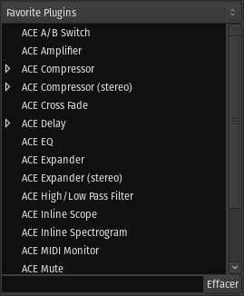

.. _favorite_plugins_window:

Favorite plugins window
=======================

The **Favorite Plugins** window is on the top-left side of the Mixer window.

   The Favorite Plugins window.

A selector at the top allows to switch between different views of the favorites:

-  **Favorite Plugins** which have been selected by the user as such,
-  **Recent Plugins** which are the *n* last used plugins, *n* being a chosen value in the Statistics section of the :ref:`Preferences <preferences_plugins>`,
-  **Top-10 Plugins** which are the *n* most used plugins, *n* being also chosen value in the Preferences (so it is more of a "Top-*n*").

At the bottom of the window is a search field to look for a specific plugin.

Features
--------

The Favorite Plugins window provides easy access to frequently used plugins:

-  Plugin names that have a right facing triangle (▷) next to them have  presets associated with them; clicking on the triangle will cause all presets associated with the plugin to show in the list.
-  Plugins can be dragged from the window to any track or bus :ref:`processor box <processor_box>`, which will add the plugin to that track or bus at the given position.
-  The list includes user-presets for the plugins. Dragging a preset to a given track or bus will load that preset after adding the plugin.
-  Double-clicking on a plugin or preset adds the given plugin to all selected tracks/busses pre-fader. Other insert positions are available from the context menu (right click).
-  Dragging a plugin from a track into the window will add it to the list and optionally create a new preset from the current settings. The horizontal line in the list shows the spot where the plugin will land.
-  The context-menu allows the deletion of presets or removal of the plugin from the list.
-  Plugins in the list can be re-ordered using drag & drop. The custom order is saved.

.. note::
   When favorites are added with the :ref:`Plugin Selector <plugin_selector>`, they are appended to the bottom of the list.
