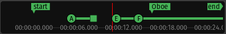

Mini-timeline
=============

   The mini-timeline

The mini-timeline allows, as the `Summary <@@summary>`__ does, navigating a session. Its main advantage, though, is that it stays visible even when in Mixer mode.

The range of time covered by the mini-timeline is set by :kbd:`right`-clicking the timeline, and choosing a time span from 30 seconds up to 20 minutes.

The mini-timeline shows all markers (*start*, *end* and any user defined ones). Clicking a marker jumps to that point on the timeline, allowing for quick access to key timings in the session. The next and previous markers out of the mini-timeline range are indicated by arrows, as the *end* marker in the screenshot above.

`Cue markers <@@mixing-linear-nonlinear-workflows>`__ are also displayed, with their play time duration shown by a line.

While hovering with the mouse over the mini-timeline:

-  :kbd:`left`-clicking moves the playhead to the time under the mouse cursor
-  using the :kbd:`scroll wheel` scrolls the playhead back and forth inside the
   session
-  using :kbd:`Ctl-scroll wheel` scrolls more finely inside the session
-  using :kbd:`Ctrl-Alt-scroll wheel` scrolls even more finely inside the session
