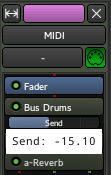

.. _audiomidi_busses_mixer_strips:

Audio/MIDI Busses mixer strips
==============================

An Ardour bus can be considered a virtual track, as in a track that doesn't have a playlist (so, no regions). Its use is to "group" some audio signals to be treated the same way. One simple use case is to group all the audio tracks containing the different drums of a drum kit. Routing all the drum tracks' outputs to a bus allows, once the different levels amongst the drums have been set, to adjust the global level of the drum kit in the mix.

Bus usage goes way beyond this simple example though: busses, as tracks, can receive plugins for common audio treatment, and be routed themselves as needed. This makes for a very useful tool that is very commonly used both for musical purposes and computing ones: instead of using e.g. ten discrete delay plugins on ten different tracks, busses are often used as receivers of :ref:`sends <aux_sends>`, and only one delay plugin is used on this bus, reducing the processing power needed.

Audio busses vs MIDI busses
---------------------------

Ardour supports two types of busses: Audio and MIDI. A MIDI bus differs
from an audio bus just by:

-  its input (which is midi, as shown by the red signal lines in the processor box) instead of *n* audio
-  the fact that an instrument can be placed on it at creation time, whereas it can't easily be done for an audio bus
-  as for tracks, the MIDI bus doesn't have a trim knob or invert phase button(s).

MIDI busses provide a particularly efficient workflow for virtual drum kits where the arrangement uses different MIDI tracks. Moreover, busses with both Audio and MIDI inputs are well suited for vocoders and similar plugins, where a MIDI signal controls an audio one.

Adding any audio input to a MIDI bus transforms it into an audio bus.

Description
-----------

Busses look and behave exactly like tracks, so they share nearly :ref:`all of
their controls <audiomidi_mixer_strips>`. The differences are:

-  as the busses don't have a playlist (and cannot host any media), they can't be recorded on. The recording controls are not present
-  an **Aux** button replaces these controls.

Clicking the Aux button makes every track that sends a signal to this bus through :ref:`Aux sends <aux_sends>` blink in turquoise. Right clicking this button brings up a menu:

Assign all tracks (prefader)
   Creates an Aux Send in every track, to this bus. The send is placed just before the fader.

Assign all tracks and busses (prefader)
   Creates an Aux Send in every track and every bus, to this bus. The send is placed just before the fader.

Assign all tracks (postfader)
   Same as above, but the send is placed just after the fader.

Assign all tracks and busses (postfader)
   Same as above, with tracks and busses.

Assign selected tracks (prefader)
   Same as for all tracks, but only applies to the selected tracks.

Assign selected tracks and busses (prefader)
   Same as for all tracks and busses, but only applies to the selected tracks and busses.

Assign selected tracks (postfader)
   Same as above, but the send is placed just after the fader.

Assign selected tracks and busses (postfader)
   Same as above, with tracks and busses.

Set sends gain to -inf
   For all the sends to this bus, put the send fader to −∞ so no signal is sent.

Set sends gain to 0dB
   For all the sends to this bus, put the send fader at the default position, 0dB (100% of the signal is sent).

Connecting a track to a bus
---------------------------

Depending on the user's workflow and the way busses are used, two
possibilities exists:

Connecting a track to a bus via its outputs
~~~~~~~~~~~~~~~~~~~~~~~~~~~~~~~~~~~~~~~~~~~

.. figure:: images/connecting_bus_output.png
   :alt: Connecting a bus through a track's outputs
   :class: right-float

Connecting the output(s) of a track to the input(s) of the bus sends *all* the audio/MIDI to the bus. In the mixer strip, select (at the bottom) the OUTPUT button (often, by default, "Master"), and in the list, choose the input of a bus. Note that only the bus able to receive this output will show up, e.g. a mono bus won't be able to be connected to the output of a stereo track).

Obviously, doing so will (by default) disconnect the output from the Master's input, which means all the audio/MIDI will be routed to the bus. For more complex routing, the OUTPUT button allows to show the routing grid that allows to plug the output of the track to multiple outputs at once, be it busses, tracks, Master… The button will then reflect these multiple connections by showing a *\*number\**, number being the number of connections made in the routing grid.

Connecting a track to a bus via sends
~~~~~~~~~~~~~~~~~~~~~~~~~~~~~~~~~~~~~

This allows not to interrupt the natural flow of the signal, i.e. the track will still output to what its connected to (e.g. Master). The signal is "tapped" at the point of insertion of the send, to be sent to the bus, by right clicking where in the signal flow the signal should be tapped, and selecting **New Aux Send… > name_of_the_bus**.

By left-clicking the send meter, it is possible to adjust the amount of signal sent to the bus. This is often the way tracks are connected to an effect bus, like a delay bus.

Busses can be plugged to other busses, through outputs or sends. Both example workflows discussed previously, i.e. busses for grouping tracks and busses for effects, can both coexist, as e.g. a "grouping" drum bus can have a send to a reverb bus, and be connected to a compressor bus.
