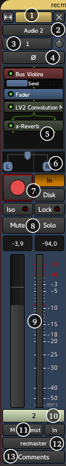

.. _audiomidi_mixer_strips:

Audio/MIDI mixer strips
=======================

A mixer strip in Ardour is a vertical view of the track, from a mixing
point of view. This view is convenient to deal with I/O, effects,
panning/muting, gain, etc… It has a general "top to bottom" flow.

The mixer strips breaks down into:

#. Header
#. Track name
#. Input(s)
#. Polarity *only for audio tracks*
#. Processor box
#. Panner
#. Recording options
#. Mute/Solo
#. Gain & Meter
#. Control master
#. Fader automation/mix group/metering point
#. Output(s)
#. Comments

Headers
-------

At the top of the window, is the :ref:`group tabs <the_track_and_bus-group_list>` (here, *recm…*). This allows to group tracks together for common controls.

Below are three buttons:

-  The double arrow button allows to shrink/expand the width of the strip. Clicking the button will shrink/expand all the tracks at once
-  The color bar shows the color of the track in the editor
-  The **X** button toggles the visibility of the track OFF. To turn it back ON, one can either go to the :ref:`Tracks and Busses list <the-tracks-and-busses-list>` in the Editor view and check the **V** column on the track's line or stay in the Mixer view and check the Show column of this strip in the :ref:`Strips list <strips-list>`.

Right-clicking on the color bar will bring up a context menu, which is exactly the same as clicking on the Track name button.

Track Name
----------

Clicking the track name button will bring up a menu:

Color…
   Changes the strip/track color.

Comments…
   Shows an editor to put comments about the track, see below the Comments button.

Inputs…
   Shows the Routing grid for the inputs of the track.

Outputs…
   Shows the Routing grid for the outputs of the track.

Save As Template…
   Allows to save the track without its media content (I/O, effects,…) for later reuse.

Rename…
   Changes the name of the track (effective both in the Mixer and the Editor).

Active
   Select the active status of the track. An inactive track won't output any sound.

Strict I/O
   While in :ref:`Strict I/O <trackbus_signal_flow>` mode, a track *always* has as many output as it has inputs, regardless of the effects. When disabled, a stereo effect put on a mono track will result in a stereo output for the strip.

Disk I/O
   This submenu allows switching between recording pre-fader signal, post-fader signal, or with custom record and playback positions. Only available for tracks.

Pin Connections…
   Shows the Pin Configuration window that shows (and allows to modify) all the signal flows inside the track. Only available for tracks and busses with at least one processor in the mixer strip.

Patch selector…
   Opens a dialog for selecting a patch provided by MIDNAM. Only available for MIDI tracks.

Fan out to Busses…
   Creates one bus per each output of a virtual instrument and connects to created busses. Only available for MIDI tracks where a virtual instrument has more than two audio outputs.

Fan out to Tracks…
   Creates one track per each output of a virtual instrument and connects to created tracks. Only available for MIDI tracks where a virtual instrument has more than two audio outputs.

Protect Against Denormals
   Uses a trick to get rid of *denormals*, which are very small numbers the CPU can have a hard time dealing with. To be used if the CPU consumption for plugins is noticeably higher than expected.

Duplicate…
   Copies the track to a new one, optionally with its playlist.

Remove
   Deletes the track and its playlist.

Inputs
------

The dropdown button shows the current input port(s), i.e. what's plugged to the "in" of the track. By default, each audio track is connected to the system inputs, ready for recording, as shown by the number(s). Clicking the dropdown Inputs button will allow to change the inputs, through a menu:

Disconnect
   Disconnects everything, i.e. the track has no input

In *n*
   Those are the system inputs, e.g. to record from the soundcard. A mono track will have *In 1* and *In 2* separated, while a stereo track can have *In 1+2*

*Track n output*
   All the outputs of compatible tracks, e.g., a mono track can only receive a mono signal, a MIDI track can only receive MIDI signal, … 

Add Audio Port
   Adds an audio input to the track, i.e. a mono audio track becomes a stereo one

Add MIDI Port
   Adds a MIDI input to the track. Adding it to an audio track makes it a mixed Audio/MIDI track. This can be useful e.g. to feed some plugins with a MIDI signal to control the audio, like a vocoder

Routing Grid
   Shows the :ref:`Routing Grid window <patchbay>`, which allows for more complex input configuration

The Routing Grid can also be shown by right clicking the dropdown Inputs button. It allows to make the connections through a matrix, and connect things that are not listed in the menu above, or connect to multiple sources at once, reduce the number of inputs, etc…

On audio tracks, is a Trim knob, as on traditional consoles. It set the base input level for the track, avoiding any clipping. Notice that it trims both any input, but (when playing back), also the level of the playlist as displayed in the Editor. It makes sense as while playing, the input of the track is the playlist, on which the mixer strip acts.

On midi tracks, it is replaced by a **MIDI Input** button that allows/disallows MIDI input on the track.

Polarity
--------

On audio tracks only, the Polarity button(s), 1 per input, allow to
reverse the signal, i.e. a negative value will be positive and
vice-versa. This can help deal with phasing issues.

.. _audio-midi-processor-box:

Processor box
-------------

The processor box is where the effects are added. By default, one effect is always present: the **fader** (see below). The effects can be added *pre*-fader and appear in brown, or *post*-fader, where they will appear in dark green. The signal flow is represented by lines, red for the MIDI and green for the audio.

It is also where the :ref:`Sends <aux_sends>` come from, whether external or auxiliary.

To learn more about the processor box, see :ref:`The Processor Box <processor_box>`.

Panner
------

The **panner** visually displays how the sound will be distributed between the different outputs. They'll look and behave differently if the track is mono, stereo, or has multiple channels.

Right clicking the panner will show a menu:

Bypass
   When checked, the panner is grayed, and the signal is not affected by it

Reset
   Resets the panner to its default settings, e.g. for a mono signal, it is centered

Edit…
   Shows a Panner dialog, which allows for fine tuning of the panner

See :ref:`Panning <panning>` to learn more about how to control the panner, and what kind of panners are available inside Ardour.

Recording options
-----------------

The most noticeable button here is the **Record Enable** one, with a red circle. When enabled, next time the global record will be armed and playback started, everything that comes from the input of the track will be recorded. Right-clicking a disabled record button allows to enable **Rec-Safe**, thus protecting the track against accidental recording.

The buttons on the right, **In** and **Disk**, show what the user is listening to by lighting up, between the **Input** and the actual content of the playlist on **Disk**.

They also allow to override the automatic switching by pressing them to lock one source or the other to be what the user is hearing.

Mute/Solo
---------

These buttons allow to **Mute** (or silence) the track, or **Solo** them, shutting down the gain of the other tracks (totally by default, can be set to partially in the options). See :ref:`Muting and Soloing <muting-and-soloing>` for more information.

Notice that by default, **Solo** overrides **Mute**, i.e. if a track is both soloed and muted, it will play. That can be changed in the preferences.

The two led button above are related to solo:

-  **Solo Isolate**, as the name suggests, isolates tracks or busses from the solo system. When tracks or busses are soloed the isolated ones will not mute.
-  **Solo Lock** locks the solo into its current state (i.e. solo on or solo off). It will not allow the solo state to be changed until the lock is released.

Gain & Meter
------------

On the right of this part is a :ref:`Meter <metering-in-ardour>`, displaying the level of the track's output after the fader. In can be set to display the signal at any point, see below *Metering Point*. Right clicking this meter shows a menu allowing to switch the meter type.

The big **Gain** slider on the left allows to change the gain of the track. Its default OdB value is reminded with a white horizontal line, and its precise value is shown in a text field above it, that doubles as a way to type in a numeric value.

The text field above the meter shows the peak, i.e. the maximum value that has been reached during playback. To avoid distortion, the value should stay below OdB, and if it goes above this value, the text field will turn red. Clicking on this field will reset the Peak value (for a new measurement or a new part of the track).

Notice that if any gain automation has been set and the automation state is set on "Play" (see below), then the Gain fader is driven by the automation, and not by the user. The Gain fader will turn grey to show it is inactive.

VCAs
----

If at least one :ref:`VCA <control_masters_mixer_strips>` exists, this button will show up, allowing the user to link this track to any control master.

Clicking the button lists all the available control masters, and a menu option to Unassign all. Notice that a track can be a slave to as many VCAs as they are in the session, hence multiplying the number of VCA buttons. The displayed number is the number of the VCA, not the count of VCAs linked to the track. A track with no VCA assigned will show a unique button with a "-vca-" label instead of this number.

Fader automation/mix group/metering point
-----------------------------------------

Fader automation mode
~~~~~~~~~~~~~~~~~~~~~

This button allows to choose the mode used regarding automation:

Manual
   *(default)* The playback won't use the fader automation data

Play
   Enables playback/use of fader automation data

Write
   While the transport is rolling, all fader changes will be recorded to the fader automation lane

Touch
   While the transport is rolling, touching the fader will initiate recording all fader changes until the fader is released. When the fader is not being touched, existing automation data will be played/used to control the gain level.

Mix group
~~~~~~~~~

This button displays the mix group information as does the tab in the header (see above). It is convenient though, as it allows to quickly switch the track from one group to another with a drop down menu, also allowing to affect the track to a non-adjacent group (which the tab won't easily allow).

Metering Point
~~~~~~~~~~~~~~

The metering displayed in the meter is by default is 'Post', i.e. Post fader. It can be changed with this button to any point of the signal flow:

In
   The input of the track
Pre
   Pre-fader

Post
   Post-fader

Out
   The output of the track

Custom
   A *Meter* processor is added to the processor box and can be set anywhere (by dragging and dropping) to probe the signal flow at that point

Output(s)
---------

This button is exactly the same as the **Input** button, but applies to the *output* of the track.

Comments
--------

This buttons open up a little text editor, that can be used to add some written notes to the track, as e.g. a particular setting. The button's caption is replaced by the beginning of the text, so it can be used as a "sub" name for the track.
