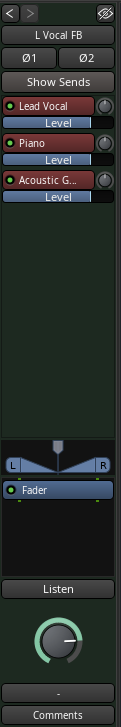
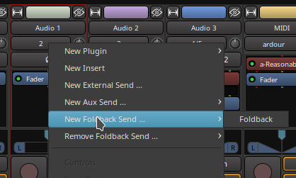
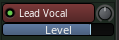

.. _foldback_strip:

Foldback strip
==============

The **Foldback** section is an optional feature that provides stage monitoring mixes. Many times the main mix is used for this purpose is a setup with only the control room. However, for a separate studio and multiple monitor mixes for in-ear use, a separate set of foldback buses provides that flexibility.

These foldback buses may be mono for a stage monitor wedge or stereo to allow in-ear or headphones to have different mixes for each ear, such as one's self in one ear and the rest of the music in the other.

A foldback bus can be created in the same manner as any other bus is created, from the **Track > Add Track, Bus or VCA Window**. Once at least one foldback bus has been created, the Foldback strip will appear in the mixer window.

Foldback sends can be created from the processor box context menu by selecting **New Foldback Send** and then the foldback bus desired.

A second method is to select all the source channels and then use the foldback bus sendbox context menu and select either **Assign Selected Tracks** or **Assign Selected Tracks and Buses**.

The **View > Mixer: Show Foldback Strip** checkbox will determine if the foldback strip is visible. The foldback strip appears Just to the left of the Master strip in the Mixer window. It comprises:

#. Previous and Next buttons
#. Hide button
#. Foldback bus name button
#. Invert button
#. Show sends button
#. Send controls
#. Bus pan control
#. Processor box
#. Listen button
#. Foldback bus level control
#. Foldback bus output routing
#. Comments button

Previous and Next
-----------------

The **Previous** button shows the previous foldback bus in the foldback strip. The **Next** button shows the next foldback strip. The button will be disabled if there are no more Foldback buses in that direction.

Hide
----

The hide button hides the Foldback strip when not being adjusted. The foldback strip can be shown again from the main menu **View > Mixer: Show Foldback Strip** item.

Name button
-----------

The name button shows the name of the current foldback bus. It has two menus the foldback bus selection menu, activated with a left-click and the context menu, activated with right-clicking. The context menu has these items in it:

-  Comments is the same as the Comments button at the bottom of the strip
-  Outputs shows the output routing grid
-  Save as a template opens the template save dialog. The template saved has the same number of channels and the same processors but does not have any sends selected.
-  Rename shows a rename dialog that allows the foldback bus name to be renamed
-  Active toggles The active status of the current Foldback bus
-  Protect Against Denormals turns on denormal protection for the current Foldback bus
-  Remove will remove the current Foldback bus

Invert buttons
--------------

The invert buttons (one for each channel) invert the audio signal. This may be useful in some situations for controlling feedback. However, proper microphone and monitor placement or the use of head phones or in ear monitoring will be more effective.

Show sends
----------

**Show sends** allows the send levels and pan to be controlled from the originating track by using the main fader for the track. The fader and pan controls will change color to indicate this mode and the show sends button will flash to indicate this mode. Changing the current foldback bus will disable this mode.

The send box
------------

The send box shows controls for each send. There is a context menu
available by right-clicking anywhere in the send box.

-  **Assign Selected Tracks** creates foldback sends on each selected track that feed the current Foldback bus
-  **Assign Selected Tracks and Buses** creates Foldback sends on each selected track and bus that feed the current Foldback bus
-  **Copy track/bus gains to sends** sets the gain on the send to be the same as the gain of the track or bus the send comes from for the current Foldback bus
-  **Set sends gain to -inf** sets the gain on all sends for the current foldback bus to −∞ (the lowest gain possible)
-  **Set sends gain to 0dB** sets the gain on all sends for the current foldback bus to 0dB

The send control block
~~~~~~~~~~~~~~~~~~~~~~

There is a send control block for every send to the current foldback bus.

The send control block features three controls:

-  The button which shows the foldback bus' name, has an active "LED"
   indicator that can be clicked to enable or disable that send and has
   a menu (mouse button 1) with items for that send:

   -  **Copy track/bus gain to send** sets the gain on the send to be the same as the gain of the track or bus the send comes from for the current foldback bus
   -  **Set send gain to -inf** sets the send gain for the current foldback bus to −∞ (the lowest gain possible)
   -  **Set send gain to 0dB** sets the send gain for the current foldback bus to 0dB
   -  **Remove This Send** removes the send from the sending track or bus.

-  The knob, only present on a stereo foldback bus, which controls the pan azimuth
-  The horizontal slider which control the level input from that channel

The pan control
---------------

This is just like every other track or bus strip and works the same way.

The processor box
-----------------

This processor box is the same as on the other tracks and buses and allows for adding things like reverb to the Foldback mix without writing it to the track. It would also be possible to add in sound from a reverb bus instead.

The Listen button
-----------------

This is only available in PFL or AFL mode as it uses the same code as the solo on other tracks and buses. It allows the control room monitor or headphones to hear what the performer will hear in their monitor.

The foldback level knob
-----------------------

This controls the output level being sent to the stage monitor.

The output port selector
------------------------

This is similar to the output selectors on the tracks and buses. It differs in only a few ways. First it is never automatically connected. A foldback bus is always meant to be directly connected to an output device and never to master or the monitor bus. The choices shown therefore reflect this.

The Comment button
------------------

Just like the track and bus comment button, this allows opening a window to type in notes about the current foldback bus for future reference.
