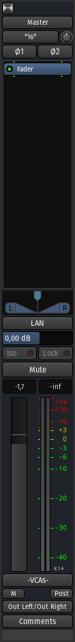

.. _master_bus_strip:

Master bus strip
================

The **Master bus** strip in Ardour is very similar to the other :ref:`busses mixer strips <audiomidi-busses-mixer-strips>`. There are nevertheless a few differences due to the nature of the Master strip, that is being the last point of treatment before the output or rendering:

-  There is no color affected to the master strip
-  There is exactly one and only one Master bus strip for a session, so it cannot be saved as a template, duplicated or removed in the context menu, although it can be renamed.
-  The master strip cannot be hidden or disabled, so there is not X in the top right, nor an **Active** checkbox in the context menu.
-  It is by definition always solo, so there is no **Solo** button, and **Iso** and **Lock** are disabled.
-  If the :ref:`Master bus output gain control <loudness-analyzer>` is enabled, two controls are visible:

   -  a **LAN** button, to start the **Loudness Analyzer & Normalizer**,
   -  a **volume slider** to that can be controlled manually or set by the **Normalizer**.

-  If the session has a :ref:`Monitoring section <session_properties_properties_monitoring>`, two buttons are visible:

   -  **Mute** to mute the Master bus while the monitoring is still active,
   -  **Mon** to show/hide the monitoring section in the Mixer view.

-  It cannot belong to a mix group, so the Grp button is missing.

The Master bus strip is *always* fixed, at the right end of the mixer, regardless of the scrolling position.
