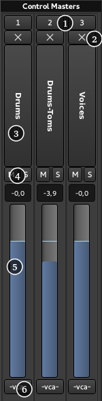

.. _vca_mixer_strips:

VCA mixer strips
================

Although track/bus :ref:`groups <the_track_and_bus_group_list>` offer a certain kind of grouped-control over gain, solo, mute and more, traditional mixing consoles have long had group master channels ("VCAs") which allows to combine both a single fader to control the group level while also allowing to easily adjust the relative levels inside the group. For large projects, this can make mixing much easier to control.

Ardour implements those VCAs in a way that allows to use either or both of the conventions used on different traditional consoles for combining multiple masters:

-  Nest VCAs (VCA 2 controls VCA 1 etc.)
-  Chain VCAs (VCA 1 and VCA 2 both control track or bus *N*)

Description of the VCAs
-----------------------

A VCA strip is made of (from top to bottom in the screenshot):

#. Number of the VCA
#. **X** button: Allows to hide the VCA strip. Left clicking this button toggles the exclusive visibility of the tracks connected to this VCA
#. Name button
#. **M**: mutes the VCA, **S**: soloes the VCA
#. Level meter: allows to adjust the level of the VCA
#. **~vca~**: a VCA button to optionally connect to another VCA

Right-clicking the name button shows a context menus comprised of:

Rename
   Renames the VCA

Color…
   Changes the color of the VCA button in the tracks connected to this one

Drop All Slaves
   Deletes all connections to this VCA, i.e. no tracks are controlled by this VCA anymore

Remove
   Deletes this VCA

Connecting to a VCA strip
-------------------------

.. figure:: images/connecting_to_vca.png
   :alt: Connecting to VCA
   :class: right-float

Connecting a track/bus/VCA to a VCA is as simple as clicking the VCA button that appears on any mixer strip under the main fader and choosing the VCA to connect to.

.. note::
   The VCA button only shows up in mixer strips when at least one VCA exists, i.e., a VCA must be created *before* connecting tracks to it.

Clicking the VCA button shows all the VCAs in the session, and any or all of this VCA can be checked to link them to the track, making this track controlled by multiple VCAs. The track will then show multiple buttons. Disconnecting a VCA from a track is done by unchecking this VCA in the list that pops up, or clicking **Unassign All** to disconnect from all VCAs at once.
