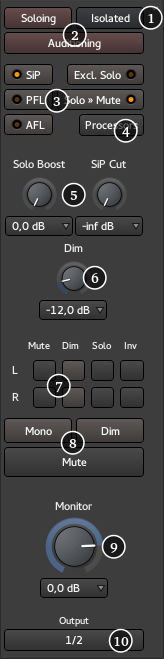

.. _monitor_section:

Monitor section
===============

The **Monitor** section is an optional feature that provides control room / monitor speaker outputs. It can be activated for the current session in the :ref:`Session > Properties window <session_properties_properties_monitoring>` by enabling the Use monitor section in this session option in the Monitoring tab. By default the Monitor Section is fed with audio from the Master bus, but depending on solo mode and other functions such as auditioning, other audio sources may be temporarily heard instead.

When you click the **Mon** button on the Master bus, the Monitor section appears on the right hand side. It comprises:

#. Detach/attach control. This separates the Monitor section into its own floating window
#. Status indicators for important functions
#. Solo behaviour selection
#. Show, hide and status of the Monitor Sections inline processors
#. Level controls for solo functionality
#. Level control for Monitor Dim
#. Individual monitor path controls
#. Mute, Dim and Mono functions for the monitor outputs
#. Monitor level control
#. Monitor output routing

Status Indicators
-----------------

The status indicators, two of which also appear in :ref:`the Transport toolbar <about_ardours_interface>`, flash to indicate when that function is in operation:

-  **Soloing**: This indicates when one or more tracks or busses are currently being soloed. See `Muting and Soloing <muting_and_soloing>`. Clicking on this indicator cancels all currently soloed channels or busses
-  **Auditioning**: This indicates when an audio file is being listened to directly, e.g. when using the import dialogue, or using the **Audition** context menu in the `Regions List <the_region_list>`. Clicking this indicator cancels the current audition
-  **Isolated**: This indicates when one or more tracks or busses are solo isolated. See `Muting and Soloing <muting_and_soloing>`. Clicking on this indicator cancels any current isolation.

Solo behaviour selection
------------------------

The SiP, PFL and AFL controls inter-cancel with each other and select the desired Solo mode. Excl. Solo and Solo Mute then modify the modes behaviour. See :ref:`Muting and Soloing <muting_and_soloing>`. The current mode is indicated by the illuminated 'LED' on the button.

SiP
   This selects *Solo In Place* as the current solo mode and cancels the previous mode.

PFL
   This selects *Pre Fade Listen* as the current solo mode and cancels the previous mode.

AFL
   This selects *After Fade Listen* as the current solo mode and cancels the previous mode.

Excl. Solo
   This enables or disables the *Exclusive Solo* option.

Solo » Mute
   This enables or disables the *Solo Mute* option.

Changing the solo mode (SiP, PFL or AFL) will update the labels on the mixer strips' solo controls accordingly.

The Processors button
---------------------

Clicking the **Processors** button show or hides the Monitor sections processor box. This is used in the same way as processor boxes present in :ref:`tracks <audiomidi_mixer_strips>` and :ref:`busses <audiomidi_busses_mixer_strips>`. It can be used to insert plugins, e.g. a room correction EQ or a specific metering type.

As this processing is local to the Monitor section it is only applied to audio that is ultimately available at the monitor outputs.

Solo level controls
-------------------

These controls set the level of the audio when a channel or bus solo is engaged.

Solo Boost
   This is the level that will be added to the current main monitor level when a track or bus is soloed, providing a convenient boost in level for the isolated signal. The rotary control has a range of 0dB to +10dB and can be set at any point between these two values. A drop down menu with pre-defined values is also provided for convenience.

SiP Cut
   Only relevant to Solo in Place mode. This sets the level that all muted tracks or busses will be muted by. By default it is −∞ i.e. the non soloed tracks are totally inaudible. The level can be raised to make the other tracks audible, though dimmed. This is also sometimes referred to *Solo in Front*. The rotary control has a range of −∞ to +0dB and can be set at any point between these two values. A drop down menu with pre-defined values is also provided for convenience.

Dim level control
-----------------

The Dim level control sets the amount by which the monitoring will be reduced when a Dim button is engaged. The rotary control has a range of -20dB to 0dB and can be set at any point between these two values. A drop down menu with pre-defined values is also provided for convenience.

Monitor path controls
---------------------

Each of the individual paths through the Monitor section, (e.g. L and R for stereo), can be controlled individually. Four functions are available:

Mute
   Mutes the selected path(s)

Dim
   Reduces the selected path(s) level by the amount set with the **Dim** level control

Solo
   Solos the selected channel(s)

Inv
   Inverts the selected channel(s) polarity

Global Monitor controls
-----------------------

Those buttons directly affect the output of the monitoring section:

-  **Mono**: sums all of the paths to a single mono signal and applies it to all Monitor section outputs.
-  **Dim**: Reduces overall monitor level by the amount set with the **Dim** level control.
-  **Mute**: Mutes all monitoring.

Global monitor level
--------------------

This control sets the level for Monitor section output. The rotary control has a range of −∞ to +6dB and can be set at any point between these two values. A drop down menu with pre-defined values is also provided for convenience.

Monitoring output routing
-------------------------

Clicking on this button shows a menu that allows quick and convenient routing of the Monitor Section's outputs to audio hardware outputs, e.g. to feed control room monitors. It also has an option to open Ardour's routing matrix, where more detailed connectivity is available if routing to something other than hardware is required.
