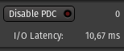
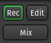

Other toolbar items
===================

.. _appbar_plugin_delay_compensation:

Plugin delay compensation
-------------------------

This section shows information about the latency compensation Ardour sets to align all signals in time whatever their route (and processing applied).

   Latency compensation info

The only button **Disable PDC** allows to enable/disable the plugin delay compensation (PDC). Enabling it will make all signal perfectly aligned, while disabling it will reduce the delay, at the expense of slightly misaligned signals for tracks that have plugins introducing latency.

The two infos are:

-  the maxium reported latency by a plugin chain (worst route latency)
-  the I/O latency, i.e. how long does it take for a signal arriving at any physical input to be played back again.

.. _appbar_cue_options:

Cue options
-----------

The two buttons control how Ardour deals with cue markers:

.. figure:: images/cue-options.png
   :alt: Cue options

   Cue options

-  **Rec Cues**: when enabled, every time you click on a cue in the Cue
   window during playback, Ardour will insert the correspinding cue
   marker at the current playhead position. Only use it when programming
   cue sequences to align with timeline content.
-  **Play Cues**: when enabled, Ardour will play the corresponding cue
   every time the playhead passes its cue marker. This option is useful
   to be on by default.

.. _appbar_master_level_meter:

Master level meter
------------------

The global meter shows the levels of the master's output. 

   The master level meter

Its the same meter that sits in the :ref:`Master's Mixer strip <master_bus_strip>`, and also shows a peak indicator, that turns red when any level exceeds 0dB. It can be reset by a left click.

.. _appbar_monitor_section_info:

Monitor section info
--------------------

This section is only useful and active if the session has a :ref:`Monitor section <monitor-section>`.

   Monitor section info

The three buttons are exactly linked to their counterparts in the Monitor slice of the mixer, but as they sit in the toolbar, remain visible even in Editor mode.

The three buttons are:

-  **Mono**: sums all of the paths to a single mono signal and applies it to all Monitor Section outputs.
-  **Dim All**: Reduces overall monitor level by the amount set with the Dim level control.
-  **Mute All**: Mutes all monitoring.

.. _appbar_status_indicators:

Status indicators
-----------------

The status buttons show the current session state.

.. figure:: images/status_buttons.png
   :alt: The status buttons

   The status buttons

Solo
   Blinks when one or more tracks are being soloed, see :ref:`Muting and Soloing <muting_and_soloing>`. Clicking this button disables any active explicit and implicit solo on all tracks and busses.
Audition
   Blinks when some audio is auditioned, e.g. by using the import dialog, or using the Audition context menu in the :ref:`Regions List <the_region_list>`. Clicking this button stops the auditioning.
Feedback
   Blinks when Ardour detects a feedback loop, which happens when the output of an audio signal chain is plugged back to its input. This is probably not wanted and can be dangerous for the hardware and the listener.

.. _appbar_script_buttons:

Script/Shortcut buttons
-----------------------

The buttons in between the mode selector and the master level meter are script or shortcuts buttons, which are user-definable buttons to attach any session :ref:`lua-script <lua_scripting>` to, or any action shortcut (e.g. for tasks that are used often and buried deep inside nested menus).

.. figure:: images/script-buttons.png
   :alt: The script buttons

   The script/shortcuts buttons

The number of buttons (precisely, the number of columns of two buttons) can be set in the :ref:`Preferences <preferences_appearance_toolbar>`.

Left-clicking an affected button launches the script or shortcut, while right-clicking or clicking an unaffected button allows change the script/shortcut the button should execute.

.. _appbar_mode_selector:

The mode selector
-----------------

The mode selector allows switching between the Editor, Mixer, or Recording windows.

   The mode selector

If a window is detached, the corresponding button is lit. Clicking the button switches the detached window visibility.
