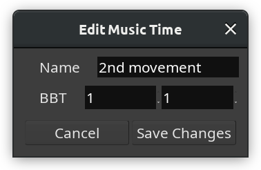
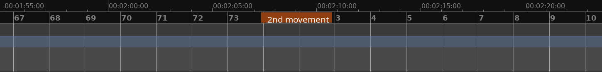

.. _bbt_markers:

Bars and beats markers
======================

Bars and beats (BBT) markers allow resetting the timeline to a particular bar and beat. Most of the time a BBT marker will reset it to 1|1|0 (the very first beat of the very first bar) so that for each song in a multi-song session there would be a musical time origin. However it's entirely possible to reset to an arbitrary value such as 7|3|0.

To create a new BBT marker, :kbd:`Ctrl`-click on the **Bars:Beats** ruler. This will open a dialog titled **New Music Time** where you can name the marker and define what bar (left field) and beat (right field) this marker should reset the time to.

   New Music Time dialog

The timeline grid and the ruler will be updated accordingly:

   The BBT marker resets the musical time

Dragging a BBT marker right or left will reset the musical time at a different position on the timeline.

Right-clicking on a BBT marker opens a menu with two options: **Edit…** and **Remove**.

Choosing **Edit…** opens the **Edit Musical Time** dialog where it's possible to rename the marker and set a different bar and/or beat to reset the musical time to:

   The Edit Musical Time dialog

Choosing **Remove** deletes the marker.
