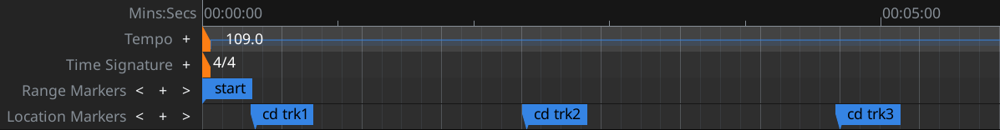

.. _cd_markers:

CD markers
==========

CD Markers are helpful for producing Cue sheets and TOC files that describe how tracks are laid out on a CD Audio media and how these tracks are named. These markers are displayed on the **Location Markers** ruler.

   CD markers

Creating CD markers
-------------------

Ardour supports two types of CD markers: single and paired. Each one of them works best in a particular scenario (more on that below).

There are several ways to create a single CD marker:

-  Right-clicking on the Location Markers ruler and selecting **Add > CD Track Marker**.
-  Any pre-existing location marker can be converted to a CD marker. Thus clicking the **New Marker** button at the bottom of the **Ranges & Marks** sidebar, then enabling the CD checkbox for the newly created marker will effectively create a new CD marker.

There are also several ways to create paired CD markers:

-  Left-clicking and dragging on the CD Markers ruler will render a red-filled preview area that encompasses the future CD marker range. Releasing the mouse button will create a pair of CD markers named CDn where n is a number that starts at 1 and is incremented by 1 (e.g. CD2, CD3 etc.) for every next pair of CD marker ranges.
-  Creating a new pair of :ref:`range markers <creating_range_markers>` in any supported way, then enabling the CD checkbox for the newly created range markers.

.. _single_vs_paired_markers:

Choosing Between Single and Paired Markers
------------------------------------------

Single and paired CD markers both target dedicated use cases, which has a lot to do with how tracks are laid in the Ardour session and how cue sheets work.

Single markers work best when each song starts immediately after the previous one. In that case the cue sheet will only reference the beginning of each song (the 'INDEX 01' section), and the TOC file will contain ranges that last from the beginning of one song to the beginning of the next song.

Paired markers define a *range* that encompasses a song. This works best when there are gaps between songs in the session. In that case, for each song, the cue sheet will also contain the 'INDEX 00' section that will reference the beginning of the pregap—the gap between songs. This will tell CD authoring software which parts of the audio file to exclude from burning to a CD. The TOC file will create ranges exactly as defined by paired CD markers.

Editing CD Markers
------------------

There are several ways to rename CD markers (both single and paired
ones):

-  Double-clicking on a marker or right-clicking on it and selecting the **Rename…** (single markers) or the **Rename Range** (paired markers) menu item brings up the dialog where the name can be changed.
-  The name can also be changed in the **Ranges & Marks** sidebar by replacing the existing one and pressing the Enter key.

CD marker name is primarily the name of the track visible in software and equipment capable of displaying individual track names. Other disc metadata, such as band name, year, total count of tracks etc. is defined in the :ref:`Edit Session Metadata <metadata>` dialog.

There are additional fields for CD markers only available for editing in the **Ranges & Marks** sidebar. All this extra information is written only into CUE and TOC files for CD authoring software.

ISRC
   The International Standard Recording Code, or `ISRC <https://usisrc.org/>`__, is a unique recording ID issued by Recording Industry Association of America, Inc. for each track separately.

Performer
   A band, an orchestra, or an individual musician who performed on the track.

Composer
   The composer who has authorship over the music in the track.

SCMS
   This enables the Serial Copy Management System (SCMS) which is a copy protection scheme that targets the use of digital audio tape (DAT) and allows the first generation of copies of the original track while preventing the second generation of copies (copies of copies).

Pre-Emphasis
   This targets the use of older CD playback equipment that uses a 14-bit converter (while dealing with 16-bit data) and noisy filters to remove frequencies higher than 22050 Hz (the Nyquist frequency). Unless treated specifically, the use of such equipment results in noise especially audible in higher frequencies. The pre-emphasis flag tells the CD authoring software to do two things: apply an equalization curve to boost higher, "weaker" frequencies, as well as write a pre-emphasis flag to the subcode stored alongside audio data so that playback software or equipment capable of de-emphasizing would process the data accordingly.

Removing CD markers
-------------------

CD markers can be deleted in several ways:

-  By clicking a marker and pressing the :kbd:`Del` key.
-  By right-clicking on a markers and selecting **Remove** (single marker) or **Remove Range** (paired marker).
-  By clicking the markers' :kbd:`X` button in the **Ranges & Marks** sidebar.

More Options
------------

The right-click menu for single and paired CD markers replicates that of :ref:`location markers <creating_location_markers>` and :ref:`range markers <creating_range_markers>` respectively.
