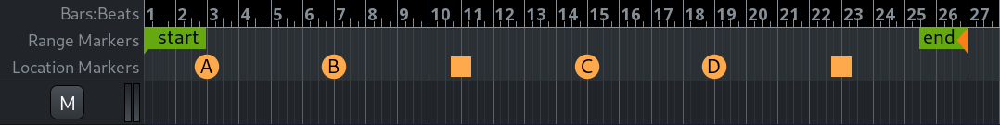
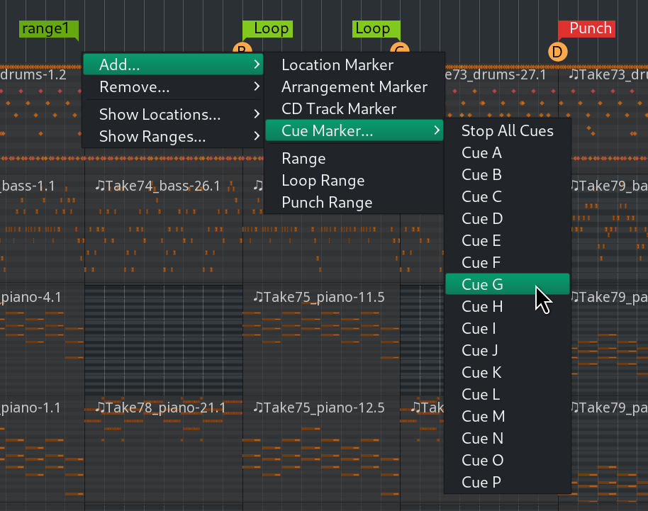

.. _cue_markers:

Cue markers
===========

Cue markers allow bridging linear and non-linear approaches to composing music. The idea is that a user can set up entire cues, then place a cue marker on the timeline to launch a cue of choice at a particular point in time. The workflow is explained in more details in the :ref:`Mixing linear and non-linear workflows <mixing_linear_nonlinear_workflows>` section.

Cue markers are displayed in the Location Markers ruler.

   Cue markers on the Location Markers ruler

.. _adding-cure-markers:

Adding cue markers
------------------

To add a cue marker, right-click on the Location Markers ruler, then selecting **Add > Cue Marker**, and then selecting a marker between **A** and **P** in the submenu.

   Right-click menu for creating a cue marker

.. _moving_cue_markers:

Moving cue markers
------------------

Left-clicking and dragging moves a single marker to a new location on the timeline.

It is possible to move multiple markers by the same distance. :kbd:`Ctrl`-left-clicking each marker creates a selection of markers that can be dragged left or right together.

.. _moving_single_marker:

Single marker
-------------

Left-clicking and dragging moves a single marker to a new location on the timeline.

.. _moving_multiple_markers:

Multiple markers
----------------

It is possible to move multiple markers by the same distance. :kbd:`Ctrl`-left-clicking each discrete marker, or :kbd:`Shift`-left-clicking the first and last markers of a range of markers selects them, then dragging one to a new location will move all selected markers together.

Stopping all cues
-----------------

Ardour has a special kind of a marker that immediately stops all playing cues. This marker (**Stop All Cues**) can be added via the right-click menu on the Cue Markers ruler.

.. _removing_cue_markers:

Removing cue markers
--------------------

Right-clicking on an existing cue marker opens the context menu with a number of options. Choosing **Remove** will delete the cue marker of choice.

When all existing cue markers have to be removed, the best option is to right-click on the **Cue Markers** ruler (any place except an existing marker) and choose **Clear All Cues**. This will delete all cue markers in the session.

More options
------------

The context menu for existing markers provides several more options:

Set Cue:
   Picking a cue from the list here will replace the selected marker with a marker for a different cue.

Locate to Here
   This will move the playhead to the cue marker's position.

Play from Here
   This will move the playhead to the cue marker's position and start playback.

Move Mark to Playhead
   This will move the selected cue marker to the current position of the Playhead.
