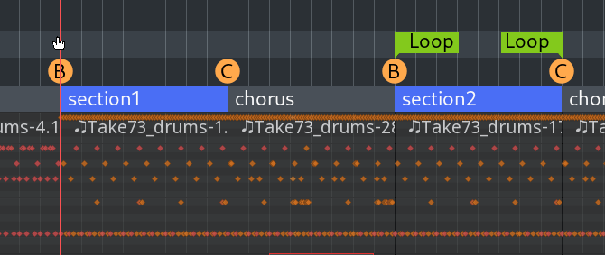
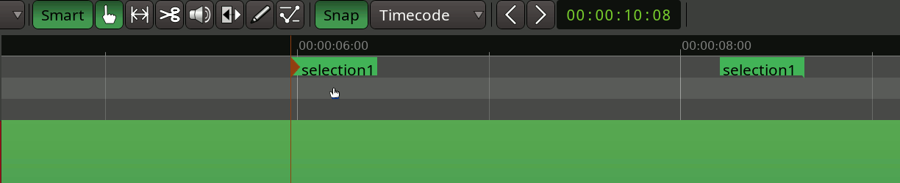
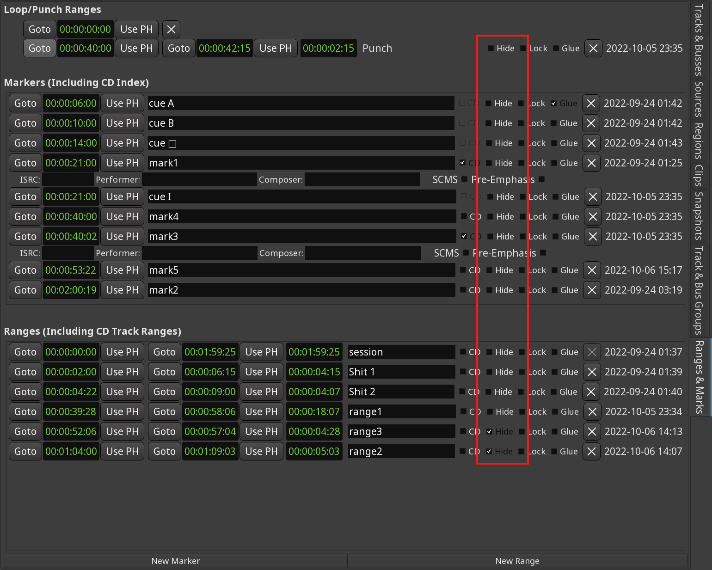
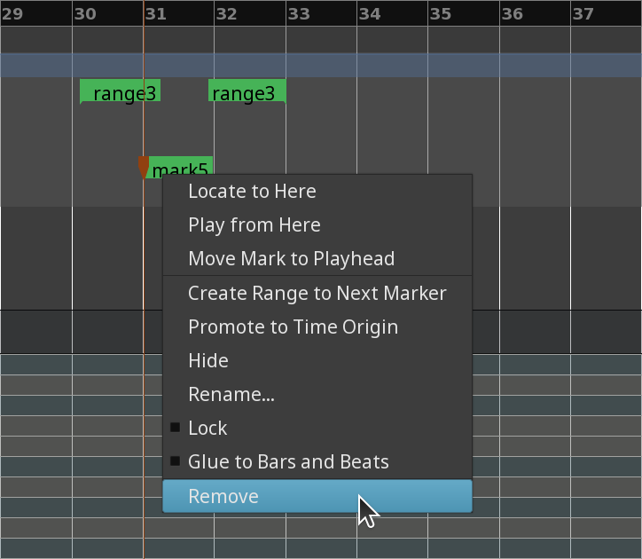

.. _markers_basics:

Markers basics
==============

Ardour supports multiple types of markers, all designed for particular
tasks: single markers that define a location, single markers that change
a value, paired markers that define a range on a timeline etc.

Creating new markers
--------------------

There are several ways to create markers in Ardour.

The most common way is to right-click over a ruler and select a menu
item called like **Add > Loop Range** (for the **Range Markers** ruler)
or **Add New Tempo** (for the **Tempo** ruler).

   Adding a new range marker

Some of the markers can be created from context menus on the canvas.
E.g. range markers can be created by creating a range, opening the
context (:kbd:`right`-click) menu and choosing **Add Range Markers**.

Additionally, location markers and range markers can be created from the
:ref:`Ranges & Marks <ranges_and_marks_lists>` sidebar by clicking **Ranges & Marks**.

Moving Markers
--------------

Once a single or a paired marker has been added, it can be moved around.

.. _moving_single_marker:

Single marker
~~~~~~~~~~~~~

Left-clicking and dragging moves a single marker to a new location on
the timeline.

Additionally, markers can be moved to playhead position by
right-clicking and choosing the **Move Mark to Playhead** menu item.

.. _moving_multiple_marker:

Multiple markers
~~~~~~~~~~~~~~~~

It is possible to move multiple markers by the same distance.
Left-clicking each discrete marker, or left-clicking the first and last
markers of a range of markers selects them, then dragging one to a new
location will move all selected markers together.

The markers are bounded by the zero point on the timeline. In other
words, the first marker in the selection cannot move to the left of zero
on the timeline.

.. _moving_entire_range_marker:

Both ends of a range marker
~~~~~~~~~~~~~~~~~~~~~~~~~~~

By left-dragging either end of the range marker, the other end will move
by the same distance.

Renaming Markers
----------------

Some markers on the ruler can have unique names: location markers, CD
markers, range markers. Double-clicking on them opens a dialog where a
different name can be submitted.

   Renaming a Marker

Alternatively, right-clicking on a marker will open a context menu with
a menu item called **Rename...** or **Rename Range...**, depending on
the type of the marker. The same dialog for submitting a new name will
appear.

.. _editing_marker_properties:

Editing marker's properties
---------------------------

Markers on rulers such as **Time Signature** or **Tempo** don't have
unique names, however they do have other properties that can be edited.
The principle is the same as with renaming: double-clicking on a marker
or right-clicking and choosing the **Edit...** menu item.

Hiding markers
--------------

Most marker types can be temporarily hidden from the ruler if the user
chooses to do so. The user interface for that is available in the Ranges
& Marks sidebar: it is a simple Hide checkbox for each marker.

   Hiding markers

Clicking the respective **Hide** checkbox again will reveal the marker
on the ruler again.

Removing markers
----------------

There are three ways to permanently delete a marker. The first one is to
right-click the marker of choice, then select **Remove** in the menu.

   Removing a location marker

The second one is to click a marker to select it, keep hovering the
mouse pointer, then press :kbd:`Del`.

The third way is to click the markers' :kbd:`x` button in the :ref:`Ranges & Marks <ranges_and_marks_lists>` sidebar.

.. _additional actions:

Controlling markers visibility
------------------------------

Right-clicking on the ruler displays two submenus: **Show Locations**
and **Show Ranges**. You can select to display all types of location or
range markers, or just one particular type.

Additional actions
------------------

Depending on the type of a marker additional actions are possible, such
as moving the playhead to a location marker's position or zooming to a
range saved with range markers. This is covered in dedicated subchapters
for respective ruler/marker types.
