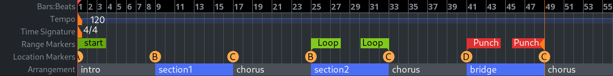

.. _rulers:

Rulers
======

   Ardour's rulers

The rulers scale the session along time, allows navigating, and can be marked for different uses.

One of its main uses is to move the playhead: clicking anywhere on the timeline will bring the playhead at this location in time. Also, using the mouse's scrollwheel while hovering the ruler will zoom in or out (:kbd:`⇑`/:kbd:`⇓`).

The ruler is made of a succession of rows, each having a special role related to time. Adding or removing rows can be done by right clicking anywhere in the ruler's header on the left, and ticking any of:

Mins:Secs 
   Scaling the session with the Mins:Secs:mSec notation
Timecode
   Scaling the session with the Hours:Mins:Secs:Frames notation
Samples
   scaling the session with the sample number notation
Bars:Beats
   Slicing the time according to the time signature
Time Signature
   Shows the time signature. It can be changed along the timeline, by **Right-click > New Time Signature**. The **Bars:Beats** ruler will reflect the change.
Tempo
   Shows the BPM. It can be changed along the timeline, by **Right-click > New Tempo**. The Bars:Beats ruler will reflect the change.
Range Markers
   Allow to create and modify ranges directly on the ruler.
Location Markers
   Is meant to receive any kind of marker, user generated or from Ardour itself.
Arrangement
   Allows creating range sections like a verse, a chorus, a bridge etc. 
Video Timeline
   Shows thumbnails of the :ref:`video <video_timeline_and_monitoring>` in the timeline

Most rulers allow placing markers to serve a specific purpose: mark a point in time, define a loop range, or something else entirely.

Most of the operations on the markers are described in the :ref:`Working with Markers <working_with_markers>` chapter, additional information on Time Signature, Tempo, Bars:Beats, and Timecode is available in the :ref:`Tempo and Time Signature <tempo_and_meter>` chapter.
