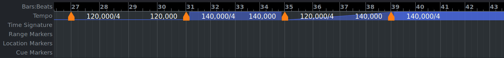
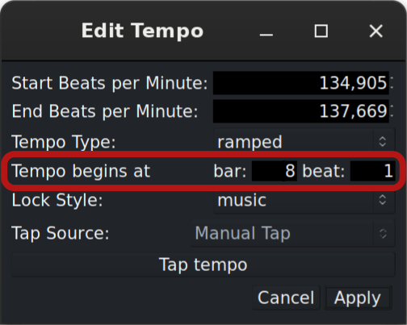
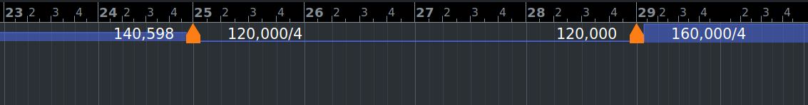
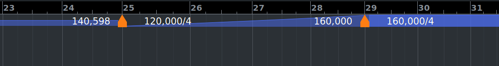

.. _tempo_ruler:

Tempo
=====

The **Tempo** ruler allows changing tempo within one session, either abruptly or gradually over time. This is done by placing tempo markers on the ruler and setting up how exactly the transition happens. Alternatively, in the :ref:`Grid mode <toolbox_grid>`, markers can be added and edited directly on the timeline.

On the screenshot below, there are 4 bars of music at 120bpm starting at bar 27, then the tempo changes abruptly to 140bpm and goes on for another 4 bars at that tempo, then abruptly changes back to 120bpm and within the next 4 bars gradually goes back to 140bpm, then continues at 140bpm until the end of the session.

   Changes in tempo over time

Anatomy of tempo markers
------------------------

Each tempo marker exposes several editable properties:

-  BPM at the start, sets a new tempo value.
-  BPM at the end *(only available for gradual transitions)*, defines
   the tempo value at the end of a tempo ramp.
-  Tempo (transition) type, defines whether the tempo is the same (constant) until the next tempo marker or whether it gradually changes (ramps up or down) towards the next tempo.
-  Location of the tempo marker, defined in musical time.
-  Lock style, defines whether tempo is locked to musical time (bars and
   beats) or real time (minutes and seconds).

Working with tempo markers on the ruler
---------------------------------------

Adding Tempo Markers
~~~~~~~~~~~~~~~~~~~~

To add a tempo marker, hover a bar or a beat line, press :kbd:`Ctrl` and single-click. Newly created tempo marker will have the same tempo value as the previous one.

Shifting tempo markers
----------------------

To change the position of a tempo change, do one of the two things:

-  Click and drag a marker left or right. Ardour will increment the change by one beat.
-  Double-click the marker or right-click it and choose **Edit** to open the marker properties dialog, then change the bar and the beat where tempo change should occur.

   Changing location of a tempo marker

Editing tempo value
~~~~~~~~~~~~~~~~~~~

The tempo start value can be changed directly on the timeline or using the tempo marker properties dialog.

To change the tempo value directly on the timeline, hover the marker, press :kbd:`Ctrl`, and drag the marker left or right. The bpm start value will change, and the grid will be adjusted accordingly.

Alternatively, double-click the marker or right-click it and choose **Edit** to open the marker properties dialog, then change the **Start beats per minute** value.

Additionally, you can set the new tempo by tapping it in one of the two ways:

-  By repeatedly clicking the Tap tempo button in the dialog.
-  By selecting a connected MIDI keyboard and repeatedly pressing either a piano key or a silicon pad.

In some cases, an existing tempo marker needs to get the same value as the tempo marker before it, typically to start a ramp. To do that, right-click the tempo marker that needs to change and select the Continue menu item.

Constant vs ramped tempo
~~~~~~~~~~~~~~~~~~~~~~~~

The tempo between two tempo markers with different bpm start values can stay the same (constant) or change gradually (ramped).

When the tempo type is constant, the line between two markers stays horizontal:

   Constant tempo

When the tempo is ramped, the line between two markers is diagonal:

   Ramped tempo

The toggle between constant and ramped types is available in the tempo marker properties menu and applies forward in the timeline. Alternatively, you can right-click a tempo marker and select the **Ramp to Next** menu item. Tempo will gradually accelerate or decelerate until the target tempo is reached, resulting in a musical *accel.* or *ritard.*

To switch from the ramped type to the constant type, either open the tempo marker properties dialog and switch it, or right-click a tempo marker and select the Set Constant menu item. The tempo will change abruptly at the next tempo marker.

Removing Markers
~~~~~~~~~~~~~~~~

To remove a tempo marker, either single-click it and press Del or right-click it and select the **Remove** menu item.

Locking to music vs audio time
~~~~~~~~~~~~~~~~~~~~~~~~~~~~~~

Audio-locked tempo markers stay in their frame position as their neighbor's positions are altered. Their pulse (musical) position will change as their neighbors move. Music-locked tempo markers move their frame position as their neighbors are moved, but keep their pulse position (they will move as the music is moved).

Working with tempo markers in the Grid mode
-------------------------------------------

For documentation on editing the tempo map in the Grid mode, please see the :ref:`relevant part <toolbox_grid>` of the Toolbox chapter.

Further Information
-------------------

For more details on the workflow, please refer to the :ref:`Tempo and Time Signature <tempo_and_meter>` chapter.
