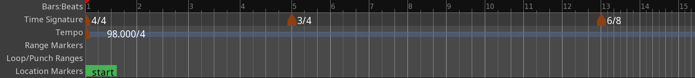
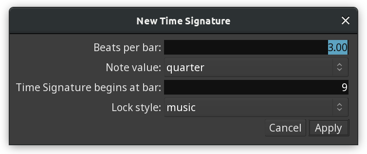

.. _time_signature:

Time signature
==============

The **Time Signature** ruler allows changing the time signature within one session. In the example below, the session starts with a time signature of 4/4, then switches to 3/4 at bar 5, then to 6/8 at bar 13. The division of the ruler and the bars/beats vertical lines on the canvas updates accordingly.

   Multiple time signatures

Ardour also supports using complex time signatures such as 11/8 or 27/32.

New time signature markers can be created in two ways:

-  :kbd:`Ctrl`-clicking on the ruler
-  Right-clicking on the ruler, then selecting the **New Time Signature** menu item

In both cases a new window will open to specify time signature settings:

   New Time Signature dialog

The right-click menu for existing time signature markers provides two options:

-  **Edit…** to open the **Edit Time Signature** dialog;
-  **Remove** to delete the selected time signature marker.

The :ref:`Time, Tempo and Time Signature <time_tempo_and_meter>` section provides more hands-on information on using this ruler in production.
