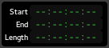

Selection and punch clocks
==========================

.. _selection_clocks:

The selection clocks
--------------------

   The range clocks

The current selection range, as set with the `Range Mode tool <@@toolbox>`__, is displayed in these three clocks: start of the range, end of the range, and length.

Clicking on the range clocks will locate to either the beginning or end of the punch range.

Right clicking on any of the clocks brings up a context menu allowing to change the type of time display between the `4 clock modes <@@editing-clocks>`__, and to copy the selected clock's time to the clipboard.

.. _punch_controls:

The Punch Controls & clocks
---------------------------

   The punch controls

   The punch clocks

The punch controls available in the main toolbar, work in conjunction with the punch clocks, only visible while in Editor mode.

The :guilabel:`In` and :guilabel:`Out` buttons relate to the Punch range, and allow to use only one of the two punch boundaries, or both:

============ ==========================================================
In only      Records from the In marker on, without an end boundary
Out only     Records until the Out marker, without a beginning boundary
In *and* Out Records only between the In and Out markers
============ ==========================================================

The punch clocks can be controlled the same way as the range clocks
(moving the playhead, and changing the display mode).

.. _rec-mode:

Recording mode
--------------

The recording mode affects how the tracks behave when overdubbing:

Layered
   New regions will be layered on top of existing ones. Only the top layer will be played. This is the recommended mode for most workflows.
Non-Layered
   The existing regions are trimmed so that there are no overlaps. This does not affect the previously recorded audio data, and trimmed regions can be expanded again at will. Non-layered mode can be very useful for spoken word material, especially in combination with `push/pull trimming <@@pushpull-trimming>`__.

Snd on Snd
   New regions will be layered on top of existing ones and made transparent. This means all overlapping layers will be played at the same time. This mode is typically recommended for progressively building up MIDI tracks, e.g. a drum track, in each individual take.

See `Track Modes <@@track-types>`__ for more information.