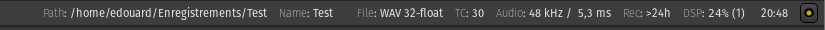

Status bar
==========

   The Status Bar

The status bar is an informative bar at the top of the window. Right
clicking anywhere on the Status Bar allows to choose which of this
information is displayed, through a checkbox menu, among:

Path to Session:
   The folder where the session files are

Snapshot Name and Modified Indicator:
   The name of the snapshot being worked on. If the session has been modified since last save, the name is prefixed with an asterisk (\*).

Active Peak-file work:
   *(Only shows up while creating peaks)* Displays the number of peak files left to create

File Format:
   The file format used in the session, including when recording

Timecode Format:
   The timecode, i.e. the number of frames per second used by the session (for videos)

Audio:
   Gives the sample rate used in the session, and the latency computed from the buffer size

Disk Space:
   Reports the remaining hard disk space as the time that can be recorded with the current session setting

DSP:
   *(Stands for for Digital Sound Processing)* Shows worst case system load used by Ardour and plugins for realtime processing. The value is the percentage of *time required to process* vs. *time available to process*

Wall Clock
   Shows the system time (especially useful in full screen mode)

Log button
   Indicates if Ardour has encountered any warning or error

Some of these indicators also double as a shortcut to a relevant action,
triggered by double clicking the info field:

Path to Session / Snapshot Name and Modified Indicator
   Opens the session path in the file explorer

File Format:
   Opens the *Media* section of the `Session Properties <@@session-properties#properties-media>`__

Timecode Format:
   Opens the *Timecode* section of the `Session Properties <@@session-properties#properties-timecode>`__

Audio:
   Opens the `Audio MIDI Setup <@@audio-midi-setup>`__ window.

Log button
   The log button turns yellow when a warning is shown, and red when an error occurs. Clicking the log button gives access to the log.
