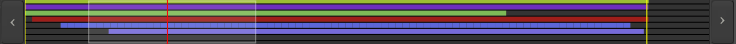

.. _summary:

Summary
=======

The Summary is a global overview of the session, allowing for a good "bird's eye" view of where in time and tracks the work happens.

   Ardour's summary

Each horizontal line represents a track in the session, with the colored bars being the audio and MIDI regions, colored as per their track's color setting.

Two yellow vertical lines show the position of the *Start* and *End* markers, defining the session's length. The red line shows the playhead's position.

The transparent white rectangle represents what's actually displayed in the Editor window, i.e. what part of the session is being looked at on screen.

The Summary also doubles as a navigator:

-  the arrow on the left allow to scroll the view horizontally to the left, by 1 length of the view each time
-  the arrow on the right allow to scroll the view horizontally to the right, by 1 length of the view each time
-  the white rectangle can be dragged anywhere on the session, moving the view accordingly
-  the right and left borders of the white square can be resized, zooming in and out accordingly
