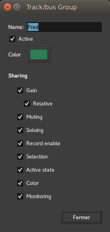

.. _track_and_bus_groups

Track and bus groups
====================

Tracks and busses can be put into groups. Members of a group can share various settings—useful for managing tracks that are closely related to each other. Examples might include tracks that contain multiple-microphone recordings of a single source (an acoustic guitar, perhaps, or a drumkit).

.. figure:: images/track-in-group.png
   :alt: Track headers for a group
   :class: right-float

Tracks and busses can be grouped in various ways. In the editor window, a track's controls might look like the adjacent image.

The green tab to the left of the track header indicates that this track is in a group called ``Fred``. These tabs can be dragged to add adjacent tracks to a group.

Create new groups
-----------------

There are several ways to create groups for tracks and busses:

-  Right-clicking on the group tab and using one of the **Create…** options there. A group can be created with no members, or one that starts with the currently selected tracks, or record-enabled tracks, or soloed tracks.
-  Alternatively, clicking the **g** button on a track header to open the **Group** menu. The menu lists the available groups. Selecting one of these groups will add the track or bus to that group. The menu also allows creating a new group.
-  Finally, the :ref:`Track and Bus Groups list <the_track_and_bus_group-list>` has a plus (**+** button at the bottom of the list that can be clicked on to create a new group.

Remove groups
-------------

Context-clicking on a group tab and selecting **Remove Group from the menu** removes it. Removing a group does *not* remove the members of a group.

Groups can also be removed by selecting them in the :ref:`Track and Bus Groups list <the_track_and_bus_group_list>` and then pressing the minus (**−**) button at the bottom of the list.

Add/remove tracks and busses from a group
-----------------------------------------

Clicking the **g** button displays a menu with a list of the available groups. Selecting one of these groups adds the track or bus to that group. Selecting **No Group** removes it.

Alternatively, a group tab can be dragged to add or remove tracks from the group.

Activate/Deactivate Groups via the Group Tab
--------------------------------------------

Clicking on a group tab toggles the group between being active and inactive. An inactive group has no effect when editing its members. An active group will share its configured properties across its members. Tabs for disabled groups are coloured grey.

Modify group properties
-----------------------

   The Track/bus Group dialog

Edit the properties of a group is done by right-clicking on its tab and choosing **Edit Group…**. This opens the track/bus group dialog, which is also used when creating new groups.

Group color
~~~~~~~~~~~

Clicking on the color selector button changes a group's color. This affects the color of the group's tab in the editor and mixer windows. The color does *not* affect the color of the group members unless the shared **Color** property is enabled.

Shared properties
~~~~~~~~~~~~~~~~~

**Gain** means that the track faders will be synced to always have the same value. **Relative means** that the gain changes are applied relative to each member's current value. If, for example, there are two tracks in a group with relative gain sharing, and their faders are set to −3 dB and −1 dB, a change of the first track to a gain of −6 dB will result in the second track having a gain of −4 dB (the *difference* of the gains remains the same).

:ref:`Muting <bus_controls>`, :ref:`Soloing <bus_controls>`, :ref:`record enable <audio_track_controls_audiotrack_record>`, :ref:`active state <the_tracks_and_busses_list>`, :ref:`color <track_color>` and :ref:`monitoring <monitoring>` are all straightforward. They simply mean that all member tracks or busses will share the same settings in these respects.

**Selection** means that if a region is selected or deselected on one member track, :ref:`corresponding regions <corresponding_regions_selection>` on other member tracks will be similarly selected. Since region editing operations are applied to all currently selected regions, this is the way to make edits apply across all tracks in the group.

Overriding grouped status
~~~~~~~~~~~~~~~~~~~~~~~~~

It's possible to override the shared status of any properties of a group. Holding :kbd:`Shift` while clicking on a grouped channel's **Mute**, **Record Enable**, **In** & **Out** monitoring controls, or fader, will invert the sense of sharing of that control.

For example, if a channel is a member of an active group with **Record Enable** shared, :kbd:`Shift`-click on that channel's **Record Enable** button will toggle only that channel's record enabled status. If a channel is a member of an inactive group, or of an active group that does not have **Record Enable** shared, :kbd:`Shift`-click on that channel's **Record Enable** button will enable or disable the record enable status of all channels in the same group.

Group tab context menu
~~~~~~~~~~~~~~~~~~~~~~

Right-clicking on the group tab offers a further menu of group-related actions.

Create a New Group  
   Create a new group.

Create New Group from…  
   Create a new group and automatically add...

Selected  
   All currently selected tracks and busses.

Rec-enabled  
   All currently record-enabled tracks.

Soloed  
   All currently soloed tracks and busses.

Collect Group  
   Moves all the member tracks so that they are together in the Editor window.

Remove Group  
   Removes the group (and only the group, not its members).

Add New Subgroup Bus  
   Creates a bus (giving it the name of the group) and connects the output of each member to the new bus.

Add New Aux Bus  
   Adds a bus and gives each member a send to that bus. There are two options for this, specifying whether the sends should be placed pre- or post-fader.

Fit to Window  
   Will zoom the member tracks so that they fill the editor window.

Enable All Groups  
   Makes all groups active, including any hidden groups.

Disable All Groups  
   Makes all groups inactive, including any hidden groups.
