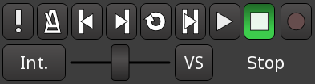

Transport bar
=============

Transport controls
------------------

The Transport bar groups all the actions regarding the control of playback and recording.

   The transport controls

.. _transport_action_buttons:

Transport action buttons
~~~~~~~~~~~~~~~~~~~~~~~~

The upper row contains transport actions, that are all bound to keyboard shortcuts, which allows for speedier use and more focused work:

Midi Panic
   Immediately stops all midi output.

Enable/disable Audio Click
   Toggles (on/off) a click track (metronome) along the `tempo <@@tempo-and-meter>`__. Right clicking brings up the :guilabel:`Click` submenu from the :guilabel:`Preferences`. Scrolling with the mouse wheel adjusts the gain of the click.

Go to Start of the Session
   Jumps back at the beginning of the session, as defined by the `start marker <@@working-with-markers>`__.

Go to End of the Session
   Jumps forward to the end of the session, as defined by the `end marker <@@working-with-markers>`__.

Play Loop Range
   Repeats the defined `loop <@@controlling-playback>`__ as defined by the `Loop range <@@the-loop-range>`__, until the :guilabel:`Stop playback` button is pressed. Clicking the :guilabel:`Play loop Range` button while already active switches to normal Play mode, which exits the loop without stopping and restarting playback.

Play Range/Selection
   If a range has been defined using the :guilabel:`Range Mode` button, plays the range, or if an audio or MIDI region is selected, plays this region. In both cases, the playback stops at the end of the range or selected region.

Play from playhead
   Starts the playback and optionally record (more below).

Stop
   Whatever the playing mode (loop, range, …) stops all playback. Depending on other settings, some effects (like chorus or reverb) might still be audible for a while.

Toggle Record
   Global switch button to activate/deactivate recording. While active, the button blinks red. The button doesn't start recording by itself: if one or more tracks are marked as record-enabled, pressing the :guilabel:`Play from Playhead` starts recording on those tracks.

If Ardour is synchronized with other devices then some or all of these control methods may be unavailable—depending on the synchronization protocol, Ardour may respond only to commands sent from its master device(s).

.. _transport_modifiers:

The transport modifiers
~~~~~~~~~~~~~~~~~~~~~~~

.. _transport_shuttle:

The shuttle speed control
^^^^^^^^^^^^^^^^^^^^^^^^^

Under these buttons is the Shuttle Speed Control that allows to *temporarily* scrub through the audio quickly. The slider decides the playback speed: the further from the center it is set, the faster the playback will scrub in both directions. The range of this acceleration can be set by right-clicking the control and setting the multiplier, either 1.5 (± 150%) or 2 (± 200%).

.. _transport_varispeed:

VariSpeed
^^^^^^^^^

The :guilabel:`VS` (for VariSpeed) button sets a *constant* playback/record speed. It can be set in semitones (1 semitone = × 2 :sup:`1⁄12` ≈ 105,9%), cents of semitones, or percentages, and is armed/disarmed by clicking the button. The VS button will blink when VariSpeed is enabled. Whether or not this VariSpeed is persistent when stopping/restarting transport depends on the :guilabel:`Reset default speed on stop` parameter in the `Preferences <@@preferences#preferences-transport>`__ dialog.

.. _transport_sync:

Transport sync
^^^^^^^^^^^^^^

On the left of the slider is the positional sync button (which might show Internal, or MTC or several other values), than can be used to control whether or not the transport position and start is controlled by Ardour, or by an external positional synchronization source, such as MIDI Time Code (MTC), Linear Time Code (LTC) or JACK (see `Timecode Generators and Slaves <@@timecode-generators-and-slaves>`__).

.. _transport_status:

Transport status
^^^^^^^^^^^^^^^^

The current playback status (Stop, Play, or speed %) is shown on the right of the speed slider.

Using key bindings
------------------

Ardour has many available commands for playback control that can be bound to keys. Many of them have default bindings, some do not, so the list below shows both the default bindings and internal command names for some of them.

===== ======================================
Space Switch between playback and stop
Home  Move playhead to session start marker
End   Move playhead to session end marker
→     Playhead to next region boundary
←     Playhead to previous region boundary
0     Move playhead to start of the timeline
===== ======================================

The :guilabel:`Transport` and :menuselection:`Transport > Playhead` menus contain a lot more transport actions and their key bindings.
