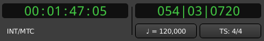

Transport clocks
================

   The transport clocks in Ardour

**Clocks** in Ardour are used to display time values precisely. In many cases, they are also one way to edit (change) time values.

In the transport bar of the editor window there are two clocks by default, that display the current position of the playhead and additional information related to transport control and the timeline. These are called the **transport clocks**; the left one is the **primary transport clock** (always showing the playhead position) and the right one is the **secondary transport clock**.

Having two transport clocks allows seeing the playhead position in two different time units without having to change any settings. For example, one can see the playhead position in both timecode units and BBT time. The secondary transport clock can nevertheless be hidden in the `Preferences <@@preferences#preferences-appearance-toolbar>`__, at :menuselection:`Appearance > Toolbar > Display Secondary Clock`.

All the clocks in Ardour share the same powerful way of editing time. Refer to `Editing Clocks <@@editing-clocks>`__ to learn how. Editing the time in the transport clocks will reposition the playhead in the same way that various other editing operations will.

The transport clocks have special attributes due to their function:

Information panel
-----------------

Under each clock is an information panel, that offers information about
the current `clock mode <@@editing-clocks#clock-modes>`__:

Timecode / Minutes:Second / Seconds
   Source of Timecode (``INT`` means that Ardour is its own timecode source)

Bars:Beats
   Current tempo and current time signature. Clicking one of this button allows changing the value.

Samples
   Sample rate (``SR``) and pull-up/down, as defined in the `session properties <@@session-properties#properties-timecode>`__.

Time origin
-----------

In the :kbd:`Right`-click menu, it is possible to change the time origin, i.e. the zero-point in time, amongst:

Display absolute time
   The zero point is the absolute start of the timeline (ignoring the session start and any timecode offsets).

Display delta to edit cursor 
   The zero point is the Edit Point as chosen from the `Edit Point selector <@@edit-point-control>`__, e.g. a selected marker.

Display delta to origin marker
   The zero point is the *start* marker of the session.

- The transport clock may display a positive or negative value depending on the temporal order of the chosen zero value and the playhead.

- The clocks will use a different color when in *delta to edit* or *delta to origin* mode to avoid confusion.

- Also, when in the two later modes, the value of the clock can not be edited.
