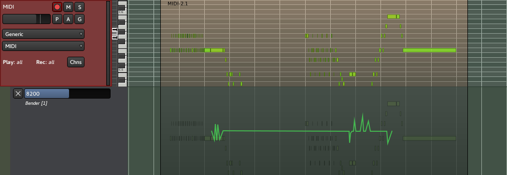

.. _pitch_bend_automation:

Pitch Bend & Aftertouch
=======================

Adding pitch bending or aftertouch can add a lot of subtlety to an
otherwise plain sounding midi region and help humanize it.

   Automation: pitch bending

Pitch bending and aftertouch both work the same way, through automation,
by right-clicking the MIDI track's header and selecting **Automation >
Bender (or Pressure) > the channel to bend**.

Using the Draw tool, just like for the automations, allows to create a
gradual change from one drawn point to another. A line in the center
produces no change to the pitch, while a line above the center will bend
the pitch to a higher note and a line going under the middle will bend
the pitch to a lower note.

The pitch change depends on the synth-plugin used. Common ranges are an
change of either ``±1``, ``±2`` or ``±4`` semitones for the range ``0``
to ``16383``. The range is usually defined by the soundfont for each
instrument. A value of ``8192``, which is also the default, means no
pitch change.

Aftertouch works very similarly, though the values are between ``0`` and
``127``. It should be noted that aftertouch differs from velocity, as
aftertouch allows to slightly change the timbre or create a vibrato,
while the velocity sets the power with which the note is played (e.g. on
a keyboard, the key is hit).
