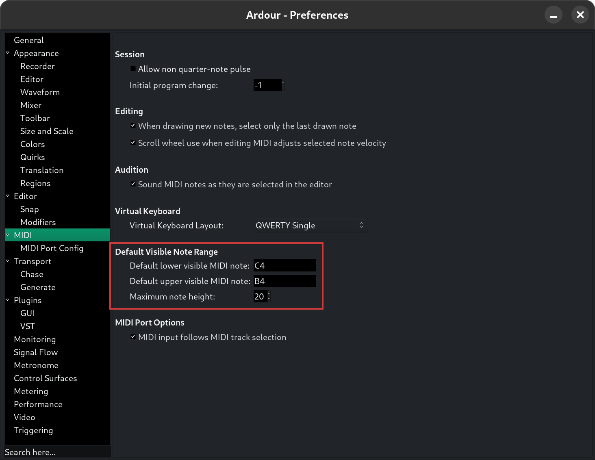

.. _controlling_midi_range:

Controlling MIDI range
======================

The visible note range in a MIDI track can be controlled in two
principle ways: the note scroomer, or the scroll wheel of your mouse.

.. _controlling-note-range-defaults:

Setting the defaults
--------------------

The default note range shown in new MIDI tracks is controllable in
**Edit > Preferences > MIDI**.

   MIDI note range defaults in Preferences

.. _controlling-note-range-using-the-mouse:

Using the scroomer
------------------

The scroomer offers two kinds of control.

Shift the note range
   "Grab" the scroomer in the middle and move it up or down—this adjusts
   the absolute note range displayed up or down.

Expand or shrink the note range
   "Grab" the top or bottom handle of the scroomer, and move that up or
   down—this adjusts the extent of the note range displayed.

.. _controlling-note-range-using-scroll:

Using your scroll wheel
-----------------------

While in internal edit mode (used for editing MIDI), several scroll
operations can be used to control the visible note range:

-  With *no notes selected*, unmodified scrolling will move the visible
   range up and down.
-  scroll will increase and decrease the visible range (zoom out and
   in).
-  scroll will expand either the top or bottom of the visible note range
   (depending on scroll direction). Think of this as "show me higher
   pitches" or "show me lower pitches".
