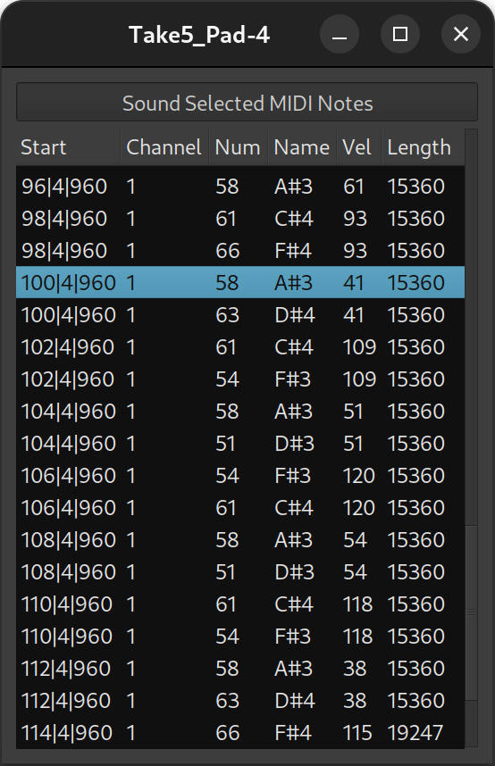

.. _midi_list_editor:

MIDI list editor
================

The List Editor is a way to look at the MIDI data of a region, not
graphically as they are displayed in the Editor, but in a tabular form.
This way of seeing the MIDI data allows for quicker "debugging" of a
MIDI region, and for fast *non-graphical* (i.e. no mouse involved)
editing. The list has a vertical flow, i.e. the first events (in time)
are at the top of the window, and the last are at the bottom.

It is accessed by selecting the **Region > MIDI > List Editor…** menu
while having one MIDI region selected, or by right-clicking the MIDI
region and choosing **<Name_Of_The_Region> > MIDI > List Editor…**.

The window displays the following MIDI data:

Start
   the timestamp of the start of the note

Channel
   the MIDI channel of the event

Num
   The :ref:`MIDI number <midi_notes_ref>` of the note

Name
   The MIDI name of the note, made of its English name and octave (e.g. ``C4``)

Vel
   the velocity of the note, i.e. its volume, between ``0`` (silent) and ``127`` (full)

Length
   duration of the note, either expressed as a number (in ticks, related to the tempo) or as a text (fraction of a beat, also related to the tempo)

At the top of the window is a **Sound Selected MIDI Notes** button,
which toggles playing a note as it is selected.

Each value can be manually modified, by left clicking it. However, the
**Name** field is derived from the **Number** field, and cannot be
edited. To change a note, its number must be changed, which will be
reflected in the **Name** field.
