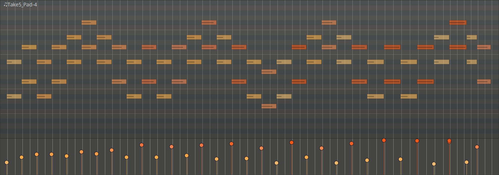

.. _editing_velocity:

Editing velocity
================

Velocity lane
-------------

To open the velocity lane, right-click on the MIDI track header and
select **Automation > Velocity**.

   Velocity lane below a MIDI track

Each notes's velocity is represented as a lollipop-shaped object. Each
lollipop object has two characteristics that represent the velocity
value:

#. The vertical position: the lower the lollipop head is, the lower is
   the velocity value, and vice versa.
#. The color: just like with notes on the timeline, it goes from pale
   yellow (low velocity) to bright red (high velocity).

Editing single notes
--------------------

To edit a single note's velocity *on the timeline*, click to select the
note in either Draw or Edit mode, then scroll the mouse wheel up or
down. The new value will be displayed in an overlay.

.. video:: videos/midi-velocity-timeline-edit-single-note.mp4
   :width: 100%

To edit a single note'velocity *on the velocity lane*, switch to the
Edit mode, grab the note's velocity lollipop, then drag it up or down:

.. video:: videos/midi-velocity-lane-edit-single-note.mp4
   :width: 100%

To edit a single note in a chord *on the velocity lane*, switch to the
Edit mode, select the note in the timeline, then draw its velocity
lollipop up or down:

.. video:: videos/midi-velocity-lane-edit-note-in-chord.mp4
   :width: 100%

Editing multiple notes
----------------------

To edit velocities of multiple notes *on the timeline*, in the Edit
mode, do a rubberband selection to select adjacent notes or press
:kbd:`Ctrl` to select non-adjacent notes (:kbd:`Shift` will select
entire chords), then hover one of the selected notes and rotate the
mouse wheel up or down. Velocities will be adjusted in all selected
notes relatively, i.e. by the same amount.

.. video:: videos/midi-velocity-timeline-edit-multiple-notes.mp4
   :width: 100%

It's also possibly to edit the velocity of multiple notes in a MIDI
region by drawing free or straight lines in the velocity lane.

To draw a free line, in Draw mode, click and draw the mouse pointer over
the velocity lane from left to right:

.. video:: videos/midi-velocity-lane-draw-freely.mp4
   :width: 100%

To draw a straight line, in Draw mode, press and hold :kbd:`Ctrl`, then
click and drag the mouse pointer to draw a straight line. Once you get
the line you expected, release the mouse button and then the :kbd:`Ctrl`
key.

.. video:: videos/midi-velocity-lane-draw-straight-iines.mp4
   :width: 100%

Just like with automation lines, you can also combine free and straight
lines in one go. Draw a free line, then press :kbd:`Ctrl` to draw
straight line, release the :kbd:`Ctrl` key, continue drawing free lines,
release the mouse button when you are'done drawing.

When multiple notes are selected on the pianoroll, free and straight
lines in the velocity lane will only affect selected notes.
