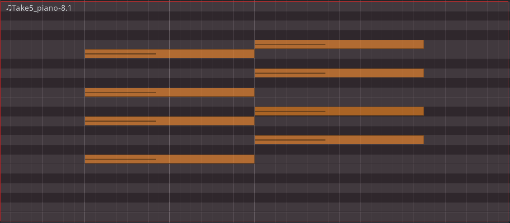
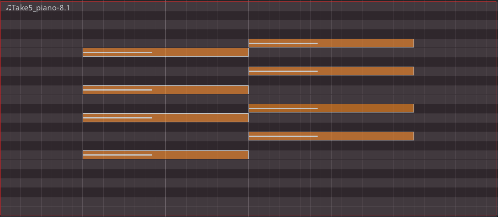
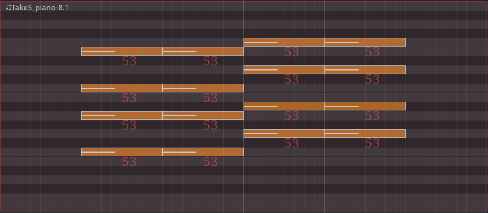
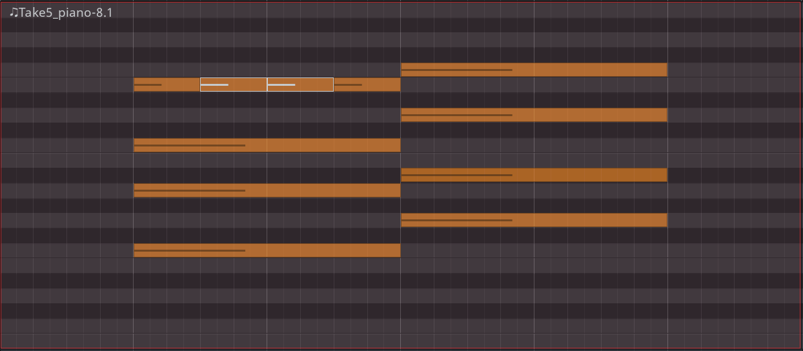
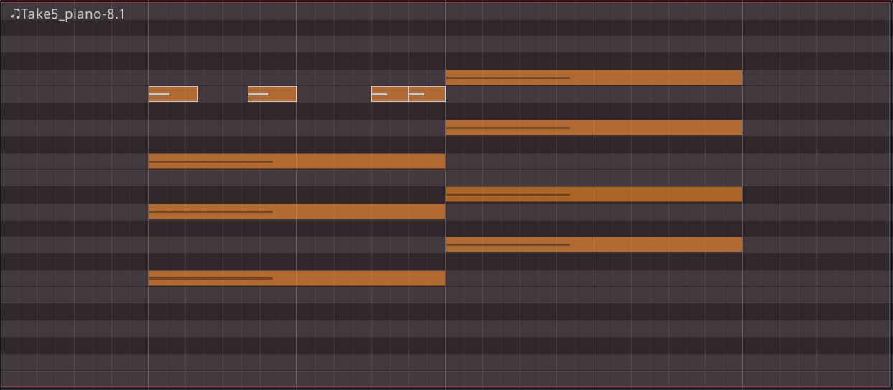
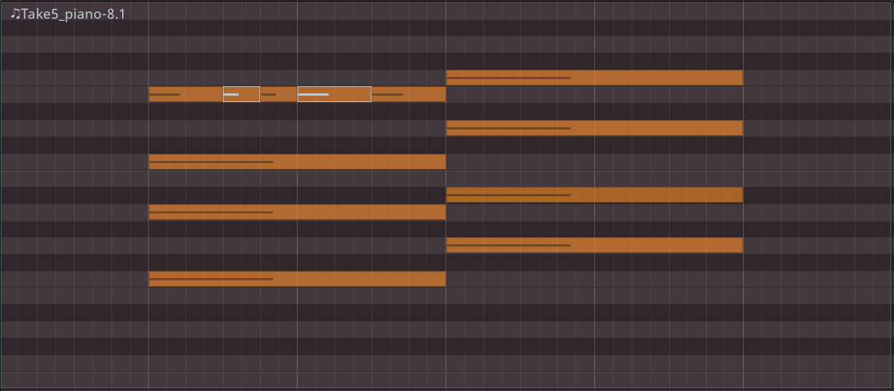

.. _note_splitting_joining:

Note splitting and joining
==========================

It is possible to evenly split (tuple) and join notes in both the
**Draw** and the **Internal Edit** modes.

Splitting notes
---------------

To split a note or a group of notes into tuplets, first select the
notes.

Press :kbd:`S` to split selected notes into two tuplets. In the example
below, each note with a duration of two whole notes will be split into
two notes, each with a duration of one whole note. For each newly
created note, Ardour will display its velocity inherited from the
original notes.

Repeatedly pressing :kbd:`S` will increment the amount of tuplets. Thus, the
next key press will divide the original note into 3 notes 2 and 2/3
beats long each, then 4 notes 2 beats long each etc. Ardour will display
a temporary message at the bottom of the MIDI region to tell how many
subdivisions have been created.

To stop incrementing the amount of subdivisions, deselect notes by
clicking elsewhere in the MIDI region or by pressing :kbd:`Esc`.

Joining notes
-------------

To join several notes into one, select the notes, then press J:

If non-adjacent notes are selected, and there is a blank space between
them, the note will extend from the beginning of the earliest note to
the end of the latest note and fill the blank spaces with itself:

If non-adjacent notes are selected, and there is at least one note
between them, newly created note will overlay the existing note:

