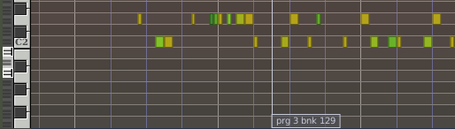
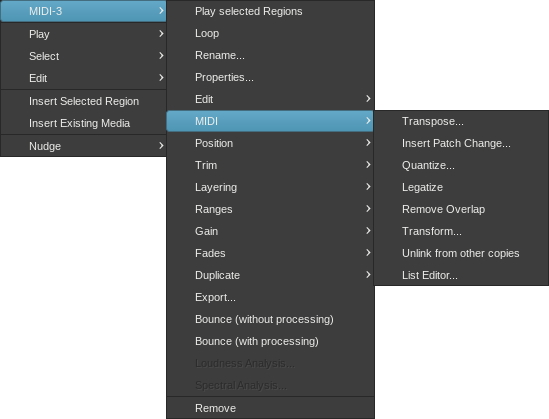
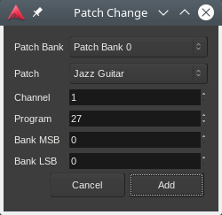

.. _patch_change:

Patch change
============

A **patch change** is Ardour's description for a combination of MIDI program
change and bank select messages, that typically instruct a synthesizer
or sampler to select a sound to use on any given channel.

   
   A patch change in a MIDI region

Patch changes are shown within MIDI regions as small rectangles or **flags**,
with a vertical line showing where in the region the patch change will
occur.

Inserting patch changes
-----------------------

A patch change is inserted by first ensuring that the mouse is in
:ref:`Grab Mode <toolbox>`, then right-clicking on the MIDI region where
the patch change is desired, then selecting **<Region Name> > MIDI >
Insert Patch Change…**. The desired patch is then chosen from the dialog
that appears.

   MIDI context menu

Inserted patch changes always appear in the selected region at the :ref:`Edit Point <edit_point_control>`.

Modifying patch changes
-----------------------

A patch change can be modified in :ref:`Internal Edit Mode <toolbox>` by
right-clicking on it, then selecting the desired patch from the menu
that appears.

A patch change can also be modified by hovering the mouse pointer over
the patch change to be modified and moving the mouse wheel until the
desired program number is selected.

The bank number can be modified similarly by holding down the
:kbd:`Shift`-key while moving the mouse wheel until the desired bank is
selected.

Moving patch changes
--------------------

A patch change can be moved, within the region in which it resides, by
left-clicking it and dragging it to the desired location.

Removing patch changes
----------------------

A patch change can be removed by holding down the :kbd:`Shift` key and
then right-clicking on it.

.. _midnam:

Names for patch numbers
-----------------------

MIDNAM files assign human-readable names to the "sound coordinates"
(Program Change, Bank Select) of MIDI synthesizers and devices. A number
of MIDNAM files come bundled with Ardour; if the MIDNAM for a device is
not included with Ardour, :ref:`a custom MIDNAM file can be
created <midnam_ref>` for device in question.

Selecting a MIDNAM is only possible if there is no MIDI synth on the
track in question or the MIDI synth does not have a MIDNAM associated
with it. In this case, it is possible to select the desired MIDNAM from
a combobox in the MIDI track's header, usually directly below the
track's fader. See :ref:`MIDI Track Controls <midi_track_controls>` for
more details.
