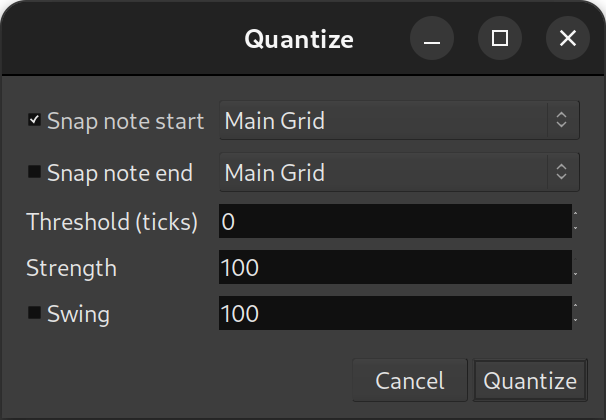

.. _quantize_midi:

Quantizing MIDI
===============

Quantizing a MIDI region, usually one recorded from a MIDI instrument,
consists in perfectly aligning the notes with the grid by shifting the
notes positions to the closest grid line. The result is a perfectly
timed MIDI region, allowing to correct rhythmically poor performance.

This dialog is accessed via the **Region > MIDI > Quantize…** while
having a MIDI region selected, or by right clicking a MIDI region,
**<Name_Of_The_Region> > MIDI > Quantize…** or with the default
:kbd:`Alt-5` shortcut and includes:

Snap note start
   If checked, the start of the notes will be aligned to the grid as
   defined in the following combo-box (see below)

Snap note end
   If checked, the end of the notes will be aligned to the grid as
   defined in the following combo-box (see below)

Threshold (ticks)
   Defines how close from a grid point a note must be in order to be
   quantized. Notes farther than this number of :ref:`ticks
   <timecode_generators_and_slaves>` will not be affected.

Strength
   Defines how close to its new position the note must be moved, as a
   percentage of the nominal distance (allowing for a non-perfect
   quantization, i.e. just making the performance rhythmically better
   without giving it a machine-generated feel)

Swing
   Applies a *swing* to the midi notes, i.e. delays every 2nd note by
   this amount, to e.g. simulate a groovy drummer

The grid selection combo boxes allow a choice between the current *main
grid*, or many beat subdivisions.

Both note start and note end can be selected at once, resulting in a
2-pass quantization: the note starts are aligned to the grid (with or
without the **Swing** and **Strength** parameters), then their ends are
aligned.

The swing is a value between ``0`` and ``130``, and is relative to the
user-selected grid type: every note which is considered a second note
(i.e. close enough to an odd grid line as per the threshold value) will
be delayed by this number of ticks.
