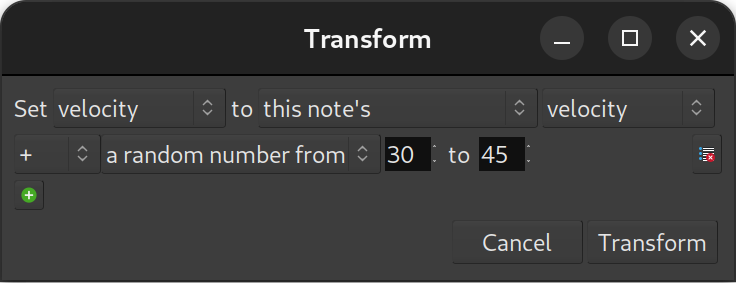

.. _transform_midi:

Transforming MIDI
=================

Considering the numerical nature of MIDI events, it can be useful to
transform a MIDI region by applying mathematical operations to it.
Ardour makes this kind of powerful transformation very easy with the
Transform tool. The tool makes possible things such as humanizing
(randomizing the velocity, start time and duration of all the notes),
creating arpeggios, automating tedious tasks, transposing, etc.

The Transform tool is accessed by right-clicking the MIDI region, then
selecting **<name_of_the_region> > MIDI > Transform…**.

First, the property to be modified in the **Set** field is selected,
then the target value is changed using the two fields that follow. If
more operands are desired, the **+** button is clicked to create new
lines. Any superfluous line can be removed by clicking on the **-**
button on the right side of the line to be removed. Finally, once
everything is set as desired, the **Transform** button is pressed to
apply the transformation.

In the image above, the **Transform** tool has been used to add a bit of
humanization, by slightly changing the velocity of each note of the
region by a random number between ``-19`` and ``+19`` from its original
velocity. So the following three operations are applied:

-  Set velocity to this note's velocity
-  + a random number from ``1`` to ``20``
-  - a random number from ``1`` to ``20``

Each note will trigger a unique calculation, where its velocity will be
increased by a random number between ``1`` and ``20``, then decreased by
a random number between ``1`` and ``20``. This will result in a new
velocity being applied to the note, which will be the original velocity
plus or minus a value ``<19``.

The parameters that can be transformed are:

-  MIDI note number (e.g. :ref:`C2 is note number 24, C#2 is 25, etc. <midi_notes_ref>`)
-  MIDI velocity (the volume of the note, between ``0`` and ``127``)
-  start time (in beats)
-  length (in beats)
-  MIDI channel

and the transformation can be based on any of the following:

-  this note's
-  the previous note's
-  this note's index (number of the note, i.e. the first one is ``0``, the
   second is ``1``, etc.)
-  exactly (for a constant value, between ``1`` and ``127``)
-  a random number from *lower* to *higher* (*lower* and *higher* being
   constant values between ``1`` and ``127``)
-  equal steps from *lower* to *higher* (*lower* and *higher* being
   constant values between ``1`` and ``127``)

The mathematical operators are:

-  ``+`` (addition)
-  ``-`` (subtraction)
-  ``*`` (multiplication)
-  ``/`` (euclidean division)
-  ``mod`` (remainder of the euclidean division)

.. note::
   While the **Transform** tool is powerful, it is not infallible.
   Things like division by zero (which does nothing), using the note's
   index and thinking that it starts at one (instead of zero), etc. can
   yield unexpected results.
