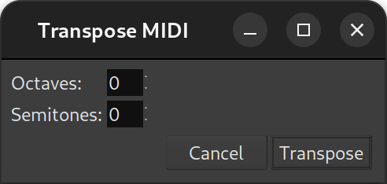

.. _transposing_midi:

Transposing MIDI
================

A whole region, or multiple regions, can be transposed at once, with the
help of the Transpose MIDI dialog, accessed by right clicking a region
and selecting **<name_of_the_midi_region > MIDI > Transpose…**.

This very simple dialog allows to choose either a number of semitones to
add or subtract to all the notes inside the region(s), and/or for more
significant changes, octaves (12 semitones).
