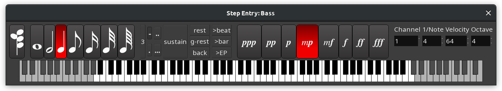

.. _step_entry:

Step entry
==========

Entering notes in Ardour can be done by using a connected MIDI device
like a MIDI keyboard or pad controller, or by using the mouse. A third
option, which provides for fine-grained control, precision and speed
comes from using Ardour's Step Entry dialog.

   Ardour's Step Entry dialog.

The step entry dialog is accessed by right-clicking on the **●**
(Rec-Enable) button of the :ref:`MIDI track <midi_track_controls>` to be
edited and selecting Step Entry from the menu that appears.

Step editing and recording MIDI via the track's MIDI port cannot happen
simultaneously.

The dialog (closely modelled on Logic's) contains:

-  Chord entry switch (successive notes are stacked in a chord until it
   is released)
-  Note length selectors
-  Triplet toggle
-  Normal, single, double and triple dotted note selectors
-  Sustain button
-  Buttons to:

   -  Insert a rest of the current selected note duration
   -  Insert a rest of the current grid step size
   -  Move back to the last inserted note
   -  Move forward to the next beat, or bar
   -  Move to the edit point

-  Dynamics controls from pianississimo to fortississimo
-  Channel selector
-  Explicit numerical velocity selector, for more precise control than
   the dynamics selectors offer
-  Octave selector
-  A full 10-octave virtual keyboard

Almost all actions in the step entry dialog can be driven directly from
the keyboard, so that moving back and forth from the keyboard to the
mouse is typically not necessary—even for complex data entry. The
default key bindings are:

======================== =========================================
:kbd:`\`` (grave accent) Set octave 0
:kbd:`1` to :kbd:`9`     Set octave 1 to 9
:kbd:`0`                 Set octave 10
:kbd:`f1`                Set note length to whole
:kbd:`f2`                Set note length to half
:kbd:`f3`                Set note length to third
:kbd:`f4` to :kbd:`f8`   Set note length to quarter to sixtyfourth
:kbd:`a`                 Insert C
:kbd:`w`                 Insert C♯
:kbd:`s`                 Insert D
:kbd:`e`                 Insert D♯
:kbd:`d`                 Insert E
:kbd:`f`                 Insert F
:kbd:`t`                 Insert F♯
:kbd:`g`                 Insert G
:kbd:`y`                 Insert G♯
:kbd:`h`                 Insert A
:kbd:`u`                 Insert A♯
:kbd:`j`                 Insert B
:kbd:`Tab`               Insert a one note length rest
:kbd:`Ctrl-Tab`          Insert a one grid unit rest
:kbd:`Backspace`         Moves the cursor back one note length
:kbd:`z`                 Set note velocity 𝆏𝆏𝆏
:kbd:`x`                 Set note velocity 𝆏𝆏
:kbd:`c`                 Set note velocity 𝆏
:kbd:`v`                 Set note velocity 𝆐𝆏
:kbd:`b`                 Set note velocity 𝆐𝆑
:kbd:`n`                 Set note velocity 𝆑
:kbd:`m`                 Set note velocity 𝆑𝆑
:kbd:`,` (comma)         Set note velocity 𝆑𝆑𝆑
:kbd:`↑`                 Set next note velocity
:kbd:`↓`                 Set prev note velocity
:kbd:`Ctrl-↑`            Set next note length
:kbd:`Ctrl-↓`            Set prev note length
:kbd:`'`                 Toggle triplet
:kbd:`.`                 Set single dotted
:kbd:`Ctrl-.`            Clear dotted
:kbd:`\|` (bar)          Toggle chord
======================== =========================================
