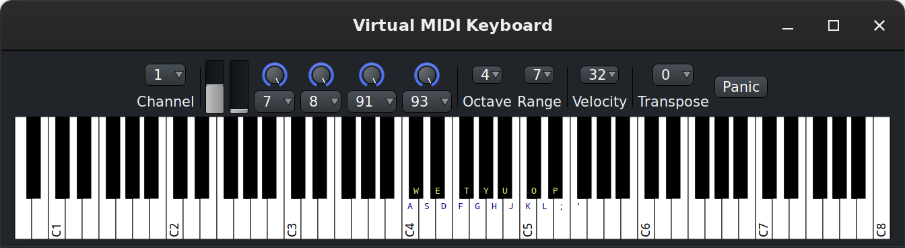

.. _virtual_keyboard:

Virtual MIDI keyboard
=====================

The Virtual Keyboard is a software MIDI instrument, similar to `VMPK
<https://vmpk.sourceforge.io/>`__, that can be used like a hardware
musical keyboard would, to emit MIDI events.

   The Virtual Keyboard window

It can be used to test or record MIDI notes or events, as the computer
keyboard can be (and is, by default) mapped to the virtual MIDI
keyboard. The keyboard layout can be chosen in the :ref:`MIDI
Preferences <preferences_midi>`.

The lower part of the window is a piano keyboard. The current keyboard
mapping is overlaid on the notes, as are the different *C* notes,
indicating what octaves are shown.

The upper part comprises (from left to right):

-  A channel selector to choose on which MIDI channel the events are
   generated
-  A pitch bend that can bend as much as the virtual instrument allows.
   The MIDI specification defines the pitch-bend range as [0..16383]. So
   Ardour maps that range to whatever the synth has and sets the
   neutral/middle position in the virtual keyboard to 8192. If the synth
   operates in the +/- 2 semitones range, that makes 1 semitone 4096
   units large. The controls are:

   -  Mousewheel up/down : persistent bend up/down
   -  Mouse-drag up/down (by left-clicking anywhere in the slider) :
      sprung-mode bend up/down (returns to +0 semitone when the mouse
      button is released)
   -  :kbd:`F1`: abruptly all the way down
   -  :kbd:`F2`: abruptly half the way down
   -  :kbd:`F3`: abruptly half the way up
   -  :kbd:`F4`: abruptly all the way up
   -  :kbd:`↓`: ramps all the way down
   -  :kbd:`↑`: ramps all the way up.

-  A modulator, with a modulation depth between ``0`` and ``127``, ``127`` being a
   modulation of ``±1`` semitone, so ``2`` semitones peak-to-peak.
-  Four assignable knobs. By default, they are:

   -  ``CC-7`` (Channel Volume)
   -  ``CC-8`` (Balance)
   -  ``CC-91`` (Reverb)
   -  ``CC-7`` (Chorus)

   These controls can be assigned as needed by clicking the button under
   each knob and selecting a different Control Number.
-  **Octave**: a selector to choose where on the keyboard (on which
   octave) the keyboard view is. The chosen octave will be the second
   one displayed, i.e. if "Octave" is set to 3, the leftmost displayed
   octave will be ``2``.
   The selected octave is also where the keyboard mapping is set, so if
   the octave is set to ``3``, in a QWERTY setup, the leftmost (lowest)
   note, :kbd:`Z`, is mapped to C3.
   The controls are:

   -  :kbd:`←`: decrease Octave by one (i.e., scroll the view to the left)
   -  :kbd:`→`: increase Octave by one (i.e., scroll the view to the right)

-  **Range** determines how many octaves are displayed.
-  **Velocity** sets the intensity of the note, which contributes to its
   audio volume, and can, depending on the virtual instrument, play a
   role in the sample selection.
   Although the drop down menu only lists a few values, scrolling the
   mouse over the control, as with the other selectors, allows to change
   its value with a finer in/decrement.
   Available shortcuts are:

   -  :kbd:`F5`: sets velocity to ``32``
   -  :kbd:`F6`: sets velocity to ``64``
   -  :kbd:`F7`: sets velocity to ``96``
   -  :kbd:`F8`: sets velocity to ``127``

-  A **Transpose** selector, that shifts the notes played by its value in
   semitones, either up or down, effectively tuning the whole keyboard.
-  A **Panic** button, to immediately stop all MIDI sound.
