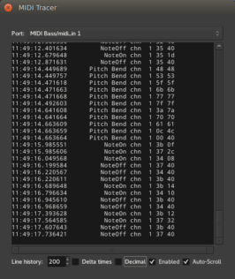

.. _midi_tracer:

MIDI tracer
===========

The MIDI Tracer window, which is accessed by selecting Window > MIDI
Tracer from the main menu, is similar to the :ref:`MIDI List
Editor <midi_list_editor>` in that it displays MIDI information as
tabular text, and has a vertical flow (i.e. the events follow a top to
bottom time-oriented order).

Its use is different however, as it is *not* bound to a specific region
or track; the MIDI shown in the MIDI Tracer window is any global input
or output Ardour presents to the system. As such, it is a very useful
way to monitor MIDI traffic, whether it is an external controller or
device or the input or output of any track.

The MIDI Tracer can list all types of MIDI and "audio" events, and
:ref:`scene automation <midi_scene_automation>` and :ref:`timecode
<timecode_generators_and_slaves>` events as well.

The window consists of:

Port
   A list of all the MIDI ports Ardour presents to the system. They are
   both internal and external and are the same ports Ardour presents to
   JACK, if enabled

The events list
   Where all the events for this port are listed, see below

Line history
   How many lines should be kept in the events list; once this limit is
   reached, older events will be removed from the list

Delta times
   If checked, shows the times as the duration since the last event,
   instead of :ref:`absolute times <on_clock_and_time>`

Decimal
   If checked, shows the MIDI data as decimal values instead of
   hexadecimal

Enabled
   If checked, events are displayed in the events list as they occur,
   otherwise stops the logging

Auto-Scroll
   If checked, the events list scrolls as new events are logged, keeping
   the newest events on screen

The events list displays the events as columns:

Time of the event
   Either absolute or relative, based on the Delta times checkbox                         |

MIDI status (event type)
   What MIDI events happened (e.g. Note On, Note Off, Pitch Bend, etc.)

MIDI channel
   The MIDI channel the event happened in

MIDI data bytes (event parameters)
   Parameters of the event, e.g. for a Note On: what the :ref:`note
   <midi_notes_ref>` was, and its velocity