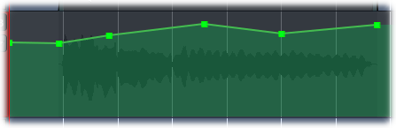

.. _automation_curves:

Automation curves
=================

An automation curve is a series of lines connected by control points
that typically defines a continuous line. As the curve is traversed from
left to right, the line defines the level of the parameter controlled by
the automation lane.

   A typical automation curve

There are two types of automation curves: **Linear** and **Discrete**.

The most common type is **Linear**, in which the space between any two
contiguous control points is continuously interpolated; in other words,
the values between any two contiguous control points at any given time
is given by the straight line connecting them.

The second type of automation curve is **Discrete**, in which no
interpolation between control points is done; whatever value the control
point is set at is the value it will yield until it reaches the next
control point, at which point it will give that value until the next
control point, and so on until there are no more control points.

.. note::
   The curve by itself does nothing; it will *only* control playback if
   the lane it resides in is in **Play** mode.
