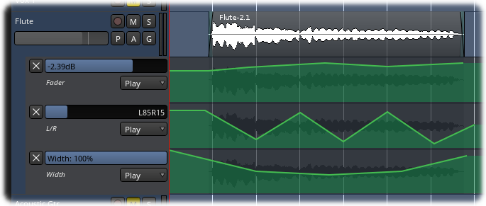

.. _automation_lanes:

Automation lanes
================

An **automation lane** is similar to a track in that it holds data that
can be played back. However, unlike a track, it is not an independent
entity—it is always attached to the track that it controls. Automation
lanes also contain zero to one **automation curves**. Each lane controls
one and only one parameter of the track it is attached to.

Every track will have at least five automation lanes associated with it:
trim, fader, mute, and pan (which consists of two lanes: L/R and Width);
it can possibly have many more if there are any processors associated
with it. All these lanes are automatically attached to the track but
hidden, and initially they are all empty (have no automation curves in
them).

   An example of a track with three lanes of automation (fader & pan).

Automation lanes typically have the following controls:

-  A hide button (square button with an "X" inside)
-  A horizontal fader
-  An **automation mode** selector

The hide button, as the name implies, hides the automation lane. The
horizontal fader controls the level of the parameter that the lane
controls; manipulating this while in **Write** or **Touch** mode during
playback will make changes to the lane's automation curve. The
automation mode selector selects which mode the lane is in (**Manual**,
**Play**, **Write**, or **Touch**).

.. note::
   The hide button will only hide the lane; it does not remove it from
   the track. The automation lane never really goes away—the closest one
   can get to that is to clear the automation curve and hide the lane.
