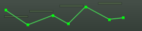
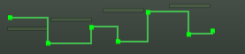

.. _automation_modes:

Automation modes
================

Ardour offers two modes for interpolating automation control points:
**Linear** and **Discrete**. The mode is changed by a right-click on the
automation lane header and choosing the mode from the mode menu.

.. container:: float

   |Automation - linear| |Automation - discrete|

**Linear** mode interpolates values between control points in a given
automation curve by connecting them with straight lines; the values
played back are derived from the points that lie on the lines thus
defined. Typically, this is what is desired and is the default mode for
all automation lanes.

**Discrete** mode does *no* interpolation between control points in a
given automation curve. The values set by the control points do not
change until the following control point is reached at which time the
value is then set to its value; this continues on until there are no
more control points. Typically this is used for parameters such as mute
or sustain pedal (e.g., on a MIDI piano track).

.. note::
   When recording automation via MIDI (e.g., pitch bend from a MIDI
   keyboard), Ardour always uses discrete mode.

