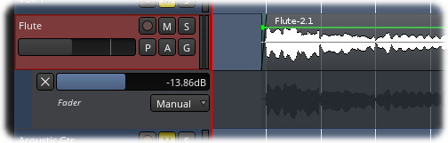

.. _automation_nomenclature:

Automation nomenclature
=======================

   
   An example of a fader automation lane (below) with its associated track (above).

Track automation occurs in one or more **lanes**. Each lane has a
control that allows setting the amount or position of a certain
**parameter** associated with the lane. Parameters are things that can
be controlled on a track's automation lane, such as volume, panning,
muting, trim, etc.

**Automation curves** typically consist of lines connected by **control
points**, that live within the confines of a lane; these tell Ardour how
to change a given parameter over time.

**Automation modes** define how Ardour creates the values in between the
control points of a given automation curve, either by connecting them
with continuous lines or not.

**Automation states** govern how a given automation lane will behave
during playback.
